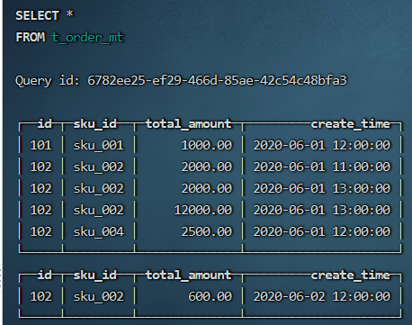
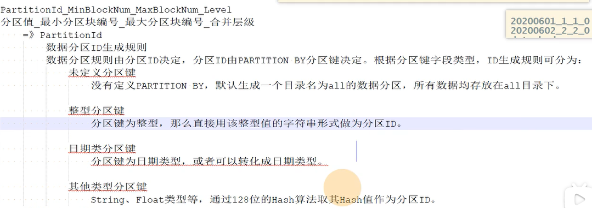
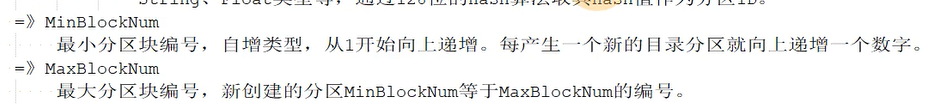
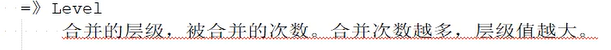
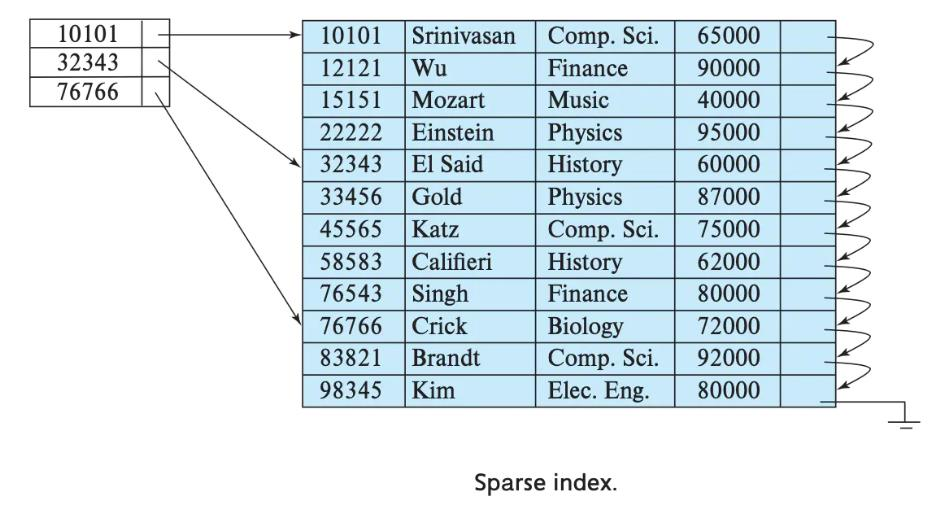
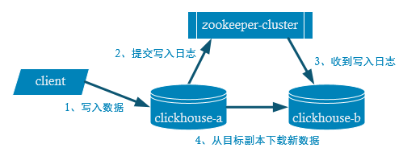
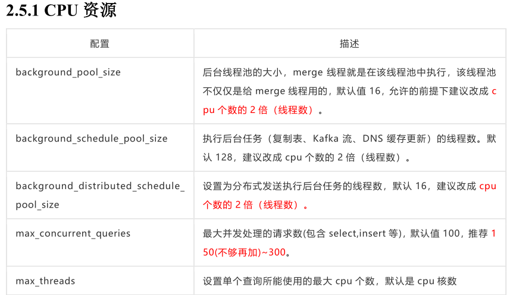
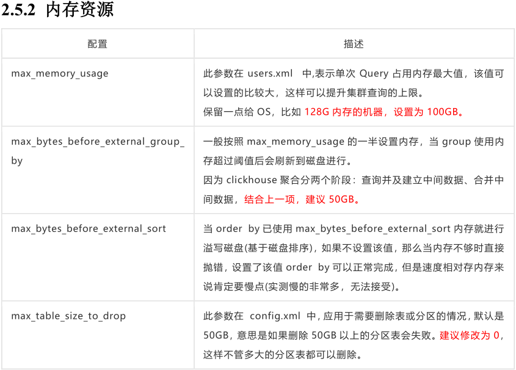
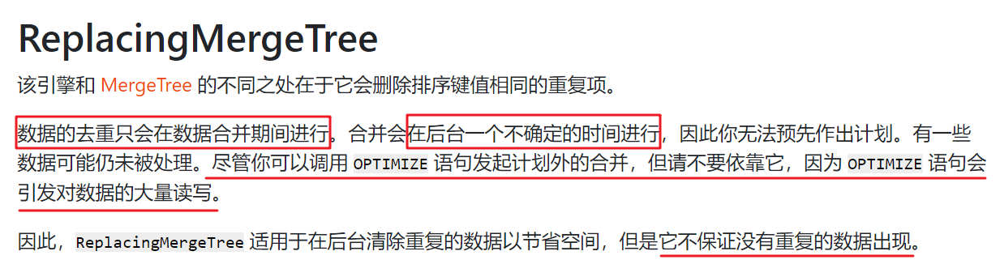
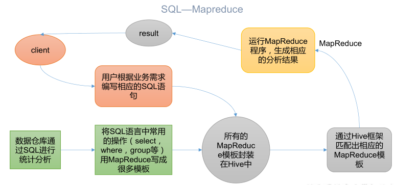

> 数据存储相关组件的类比、对比学习总结


## JDBC

### 简介

- JDBC(Java Database Connectivity)是一个**独立于特定数据库管理系统、通用的SQL数据库存取和操作的公共接口**（一组API），定义了用来访问数据库的标准Java类库，（**java.sql,javax.sql**）使用这些类库可以以一种**标准**的方法、方便地访问数据库资源。
- JDBC为访问不同的数据库提供了一种**统一的途径**，为开发者屏蔽了一些细节问题。
- JDBC的目标是使Java程序员使用JDBC可以连接任何**提供了JDBC驱动程序**的数据库系统，这样就使得程序员无需对特定的数据库系统的特点有过多的了解，从而大大简化和加快了开发过程。
- 如果没有JDBC，那么Java程序访问数据库时是这样的：


***

- 有了JDBC，Java程序访问数据库时是这样的：


***

- 总结如下：


### 连接示例

####  连接方式一

```java
	@Test
    public void testConnection1() {
        try {
            //1.提供java.sql.Driver接口实现类的对象
            Driver driver = null;
            driver = new com.mysql.jdbc.Driver();

            //2.提供url，指明具体操作的数据
            String url = "jdbc:mysql://localhost:3306/test";

            //3.提供Properties的对象，指明用户名和密码
            Properties info = new Properties();
            info.setProperty("user", "root");
            info.setProperty("password", "abc123");

            //4.调用driver的connect()，获取连接
            Connection conn = driver.connect(url, info);
            System.out.println(conn);
        } catch (SQLException e) {
            e.printStackTrace();
        }
    }
```

> 说明：上述代码中显式出现了第三方数据库的API

#### 连接方式二

```java
	@Test
    public void testConnection2() {
        try {
            //1.实例化Driver
            String className = "com.mysql.jdbc.Driver";
            Class clazz = Class.forName(className);
            Driver driver = (Driver) clazz.newInstance();

            //2.提供url，指明具体操作的数据
            String url = "jdbc:mysql://localhost:3306/test";

            //3.提供Properties的对象，指明用户名和密码
            Properties info = new Properties();
            info.setProperty("user", "root");
            info.setProperty("password", "abc123");

            //4.调用driver的connect()，获取连接
            Connection conn = driver.connect(url, info);
            System.out.println(conn);

        } catch (Exception e) {
            e.printStackTrace();
        }
    }
```

> 说明：相较于方式一，这里使用反射实例化Driver，不在代码中体现第三方数据库的API。体现了面向接口编程思想。

####连接方式三

```java
	@Test
    public void testConnection3() {
        try {
            //1.数据库连接的4个基本要素：
            String url = "jdbc:mysql://localhost:3306/test";
            String user = "root";
            String password = "abc123";
            String driverName = "com.mysql.jdbc.Driver";

            //2.实例化Driver
            Class clazz = Class.forName(driverName);
            Driver driver = (Driver) clazz.newInstance();
            //3.注册驱动
            DriverManager.registerDriver(driver);
            //4.获取连接
            Connection conn = DriverManager.getConnection(url, user, password);
            System.out.println(conn);
        } catch (Exception e) {
            e.printStackTrace();
        }

    }
```

> 说明：使用DriverManager实现数据库的连接。体会获取连接必要的4个基本要素。

#### 连接方式四

```java
	@Test
    public void testConnection4() {
        try {
            //1.数据库连接的4个基本要素：
            String url = "jdbc:mysql://localhost:3306/test";
            String user = "root";
            String password = "abc123";
            String driverName = "com.mysql.jdbc.Driver";

            //2.加载驱动 （①实例化Driver ②注册驱动）
            Class.forName(driverName);


            //Driver driver = (Driver) clazz.newInstance();
            //3.注册驱动
            //DriverManager.registerDriver(driver);
            /*
            可以注释掉上述代码的原因，是因为在mysql的Driver类中声明有：
            static {
                try {
                    DriverManager.registerDriver(new Driver());
                } catch (SQLException var1) {
                    throw new RuntimeException("Can't register driver!");
                }
            }

             */


            //3.获取连接
            Connection conn = DriverManager.getConnection(url, user, password);
            System.out.println(conn);
        } catch (Exception e) {
            e.printStackTrace();
        }

    }
```

> 说明：不必显式的注册驱动了。因为在DriverManager的源码中已经存在静态代码块，实现了驱动的注册。

#### 连接方式五(最终版)

```java
	@Test
    public  void testConnection5() throws Exception {
    	//1.加载配置文件
        InputStream is = ConnectionTest.class.getClassLoader().getResourceAsStream("jdbc.properties");
        Properties pros = new Properties();
        pros.load(is);
        
        //2.读取配置信息
        String user = pros.getProperty("user");
        String password = pros.getProperty("password");
        String url = pros.getProperty("url");
        String driverClass = pros.getProperty("driverClass");

        //3.加载驱动
        Class.forName(driverClass);

        //4.获取连接
        Connection conn = DriverManager.getConnection(url,user,password);
        System.out.println(conn);

    }
```

其中，配置文件声明在工程的src目录下：【jdbc.properties】

```properties
user=root
password=abc123
url=jdbc:mysql://localhost:3306/test
driverClass=com.mysql.jdbc.Driver
```

> 说明：使用配置文件的方式保存配置信息，在代码中加载配置文件
>
> **使用配置文件的好处：**
>
> ①实现了代码和数据的分离，如果需要修改配置信息，直接在配置文件中修改，不需要深入代码
> ②如果修改了配置信息，省去重新编译的过程。


### JDBC的CURD

#### 操作和访问数据库

- 数据库连接被用于向数据库服务器发送命令和 SQL 语句，并接受数据库服务器返回的结果集。其实一个数据库连接就是一个Socket连接。

- 在 java.sql 包中有 3 个接口分别定义了对数据库的调用的不同方式：

    - Statement：用于执行静态 SQL 语句并返回它所生成结果的对象。 
    - PrepatedStatement：SQL 语句被预编译并存储在此对象中，可以使用此对象多次高效地执行该语句。
    - CallableStatement：用于执行 SQL 存储过程

    


#### 使用Statement操作数据表的弊端

- **问题一：存在拼串操作，繁琐**
- **问题二：存在SQL注入问题**


#### PreparedStatement介绍

- 可以通过调用 Connection 对象的 **preparedStatement(String sql)** 方法获取 PreparedStatement 对象

- **PreparedStatement 接口是 Statement 的子接口，它表示一条预编译过的 SQL 语句**

- PreparedStatement 对象所代表的 SQL 语句中的参数用问号(?)来表示，调用 PreparedStatement 对象的 setXxx() 方法来设置这些参数. setXxx() 方法有两个参数，第一个参数是要设置的 SQL 语句中的参数的索引(从 1 开始)，第二个是设置的 SQL 语句中的参数的值


### DAO

- DAO：Data Access Object访问数据信息的类和接口，包括了对数据的CRUD（Create、Retrival、Update、Delete），而不包含任何业务相关的信息。有时也称作：BaseDAO
- 作用：为了实现功能的模块化，更有利于代码的维护和升级


### 数据库连接池

- **数据库连接池的基本思想**：就是为数据库连接建立一个“缓冲池”。预先在缓冲池中放入一定数量的连接，当需要建立数据库连接时，只需从“缓冲池”中取出一个，使用完毕之后再放回去。
- **数据库连接池**负责分配、管理和释放数据库连接，它**允许应用程序重复使用一个现有的数据库连接，而不是重新建立一个**。
- 数据库连接池在初始化时将创建一定数量的数据库连接放到连接池中，这些数据库连接的数量是由**最小数据库连接数来设定**的。无论这些数据库连接是否被使用，连接池都将一直保证至少拥有这么多的连接数量。连接池的**最大数据库连接数量**限定了这个连接池能占有的最大连接数，当应用程序向连接池请求的连接数超过最大连接数量时，这些请求将被加入到等待队列中。


## MyBatis


## HDFS


## Kafka

### 集群部署

- 更改./config/server.properties
    - broker.id=0 代表不同的机器，不能重复
    - log.dirs=/opt/module/kafka/datas
    - zookeeper.connect=hadoop1:2181,hadoop2:2181,hadoop3:2181/kafka   配置连接zk集群地址，在zk根目录下创建/kafka，方便管理
- 环境变量
    - export KAFKA_HOME=/opt/module/kafka
    - export PATH=\$PATH:\$KAFKA_HOME/bin

### 启动与关闭

```shell
#单点启动
bin/kafka-server-start.sh -daemon config/server.properties
#单点关闭
bin/kafka-server.sh-stop.sh
```


多点启动脚本，放入\$HOME/bin，并给予足够的启动权限

```shell
#! /bin/bash 
case $1 in
"start"){
for i in hadoop1 hadoop2 hadoop3 
do
echo " --------启动    $i Kafka-------"
ssh  $i  "/opt/module/kafka/bin/kafka-server-start.sh  -
daemon /opt/module/kafka/config/server.properties" 
done
};;
"stop"){
for i in hadoop1 hadoop2 hadoop3 
do
echo " --------停止    $i Kafka-------"
ssh $i "/opt/module/kafka/bin/kafka-server-stop.sh " 
done
};; 
esac
```


**停止 Kafka 集群时，一定要等 Kafka 所有节点进程全部停止后再停止 Zookeeper** 
**集群。因为 Zookeeper 集群当中记录着 Kafka 集群相关信息，Zookeeper 集群一旦先停止，** 
**Kafka 集群就没有办法再获取停止进程的信息，只能手动杀死 Kafka 进程了。**


### 命令行操作


```shell
#查看操作主题命令参数：
bin/kafka-topics.sh
#查看当前服务器中的所有topic
bin/kafka-topics.sh --bootstrap-server hadoop1:9092 --list
#创建名为first的topic
bin/kafka-topics.sh --bootstrap-server hadoop1:9092 --create --partition 1 --replication-factor 3 --topic first
#查看first主题详情
bin/kafka-topics.sh --bootstrap-server hadoop1:9092 --describe --topic first
#修改分区数,分区数只能增加，不能减少
bin/kafka-topics.sh --bootstrap-server hadoop1:9092 --alter --topic first --partitions 3
#删除topic
bin/kafka-topics.sh --bootstrap-server hadoop1:9092 --delete --topic first
```


```shell
#生产者命令行操作
bin/kafka-console-producer.sh --bootstrap-server hadoop1:9092 --topic first
```


```shell
#消费者命令行操作
#消费first主题中的数据
bin/kafka-console-consumer.sh --bootstrap-server hadoop1:9092 --topic first

#把主题中所有的数据都读取出来（包括历史数据）
bin/kafka-console-consumer.sh --bootstrap-server hadoop1:9092 --from-beginning --topic first
```


## MySQL


### 安装：

**mysql8.0**

```shell
show global variables like 'port'; 如果端口为0，则需要修改配置文件了。

mysql --help|grep my.cnf 查看配置文件所在处

默认my.cnf会把mysqld.cnf 屏蔽掉，解开屏蔽即可，然后绑定端口为0.0.0.0
```


### 常用命令：

```sql
##shell登录
mysql -h host -p port -u username -ppassword
##启动服务第一次（mac不行）
service mysqld start
service mysqld restart
service mysql status

##1.查看当前所有的数据库
show databases;
##2.打开指定的库
use 库名
##3.查看当前库的所有表
show tables;
##4.查看其它库的所有表
show tables from 库名;
##5.查看表结构
desc 表名;
##6.查看服务器的版本
##方式一：登录到mysql服务端
select version();
##方式二：没有登录到mysql服务端
mysql --version
mysql --V
```


### DDL:

#### 库的管理：

```sql
#一、创建库
create database [if not exists]库名

#二、修改库
#基本上不修改库，容易导致数据丢失
#直接去programData去手动改库名
#可以更改库的字符集
alter database 库名 character set gbk；

#三、删除库
drop database 库名
```


#### 表的管理：

##### 1.创建表

```sql
create table 表名(
		  列名 列的类型[(长度) 约束],
    	列名 列的类型[(长度) 约束],
    	列名 列的类型[(长度) 约束],
    	列名 列的类型[(长度) 约束],
);
create table book(
	  id INT,
    bName VARCHAR(20)#最大长度必须写,
    price DOUBLE,
    authorId INT,#分类存储减少冗余
    publishDate DATETIME
);
```

##### 2.修改表 alter

```sql
#语法：
ALTER TABLE 表名 ADD|MODIFY|DROP|CHANGE COLUMN 列名 【列类型  约束】;
```

###### ①修改列名

```sql
ALTER TABLE book CHANGE COLUMN publishdate pubDate DATETIME;
```

###### ②修改表名

```sql
ALTER TABLE book RENAME [TO] book_authors;
```

###### ③修改列类型和列级约束

```sql
ALTER TABLE book MODIFY COLUMN pubDate TIMESTAMP ;
```

###### ④添加列

```sql
ALTER TABLE author ADD COLUMN annual DOUBLE;
```

###### ⑤删除列

```sql
ALTER TABLE book DROP COLUMN annual;
```

##### 3.删除表

```sql
DROP TABLE [IF EXISTS] book_author;
show tables;#查看当前库的所有表
```

##### 4.复制表

```sql
insert into author 
values 
(1,'村上春树','日本'),
(2,'莫言','中国'),
(3,'冯唐','中国'),
(4,'金庸','中国');

#1仅仅复制表的结构
create table copy like author;

#2复制表的结构+数据
create table copy2
select * from author;

#只复制部分数据
create table copy3
select id,au_name
from author 
where nation='中国';

#仅仅复制某些列
create table copy3
select id,au_name 
from author
where 1=2;# where 0;
```


### DQL:

#### 1.基础查询

```sql
#查询常量、表达式、函数
select 100;
select 'john';
select 100%98 as 结果;
select version();

# + 号只有运算符作用
select 100+90;#两个操作数都为数值型，则做加法运算
select '123'+90;其中一方为字符型，试图将字符型数值转换成数值型，如果转换成功，则继续做加法运算
select 'john'+90;如果转换失败，则将字符型数值转换成0；
select null+10;只要其中一方为null，则结果肯定为null

#关键字冲突，将要查询的变量用着重号包起来
select `id` from users;
```


#### 2.条件查询

```sql
#条件表达式
不等于： != , <>  , -ne
等于 =， <=>

#逻辑表达式
&&, ||, !
and or not  <- 推荐使用

#模糊查询
like 
		一般和通配符搭配使用，% 任意多个字符包括0个字符，_ 任意单个字符，可用\转义，\_代表'_'字符
between and
		包含临界值，前小后大
		可以为not between and
in
		in列表内值类型必须统一或兼容，不支持通配符
is null/ is not null
		= 或者 <> 不能用于判断null值，is null 和is not null 不能判断其他值
		<=> 安全等于，既可以判断null，也可以判断其他值
```


#### 3.排序查询

```sql
order by 排序的字段|表达式|函数|别名 【asc|desc】   默认升序
```


#### 4.分组查询

```sql
1、可以按单个字段分组，可以是表达式
#######2、和分组函数一同查询的字段最好是分组后的字段，保证维度一致####################
3、分组筛选
			      针对的表		   位置			         关键字
分组前筛选：	原始表		      group by的前面    where
分组后筛选：	分组后的结果集	 group by的后面		having

######分组函数做条件肯定是放在 having 子句中#########
######优先考虑使用分组前筛选，性能高#########

4、可以按多个字段分组，字段之间用逗号隔开(相同选择的分组)

#查询每个部门每个工种的员工的平均工资
select AVG(salary),department_id,job_id
from employees
group by department_id,job_id;
###取分组的组合，都一样才是一个组，与顺序无关####

5、可以支持排序

#查询每个部门每个工种的员工的平均工资，并按平均工资高低显示
select AVG(salary),department_id,job_id
from employees
group by department_id,job_id;
order by AVG(salary) desc;

6、 having后可以支持别名， group by 后面也可以别名
#####oracle数据库 having和 group by后面不支持别名###
```


#### 5.连接查询

```sql
笛卡尔乘积：如果连接条件省略或无效则会出现
select name ,boyName from beauty,boys;
会遍历第一张表的元素对应第二张表，输出为 count * count
```


#### 6.子查询

**外面的语句可以是insert,update,delete,select等，一般select作为外面语句较多**

```sql
按子查询出现的位置：
	select 后面
		：仅仅支持标量子查询
	from 后面
		：支持表子查询
	where 或 having 后面  ★
		：支持标量子查询	★(单行)
			 列子查询	   ★（多行）
			 行子查询
	exists 后面（相关子查询）
		：支持表子查询
按结果集的行列数不同：
	标量子查询（结果集只有一行一列）
	列子查询（结果集只有一列多行）
	行子查询（结果集可以有一行多列）
	表子查询（结果集一般为多行多列）
```


**exists 后面（相关子查询）**

```sql
语法：exists(完整的查询语句)
结果1或0
```

```sql
#查询有员工的部门名
select department_name
from departments d
where exists(
	select *
    from employees e
    where d.department_id=e.department_id
)

#in
select department_name
from departments d
where d.department_id in(
	select department_id
    from employees
)
```

```sql
#查询没有女朋友的男神信息
#in
select bo.*
from boys bo
where bo.id not in(
	select boyfriend_id
    from beauty
)

#exists
select bo.*
from boys bo
where not exists(
	select boyfriend_id
    from beauty b
    where bo.id=b.boyfriend_id
)
```

#### 7.分页查询-limit


```sql
select 字段|表达式,...
from 表1
【join type】 join 表2
on 连接条件
【where 筛选条件】
【group by 分组字段】
【having 分组后的筛选】
【order by 排序的字段】
limit 【起始的条目索引 offset(起始索引从0开始)】，条目数 size;

#查询前五条员工信息
select *
from employees
limit 0,5;

select *
from employees
limit 5;

#查询第11条-第25条
select *
from employees
limit 10,15;

#有奖金的员工信息，并且工资较高的前10名显示出来
select *
from employees
where commission_pct is not null
order by salary desc
limit 0,10;
```


#### 8.联合查询

**将多条查询语句的结果合并成一个结果**


```sql
#查询中国用户男性信息以及外国用户中男性的用户信息（多张表，但是多张表之间没有连接关系时使用，多使用在查询信息一致的情况下）
select id,cname,csec 
from t_ca where csex='男'
union
select t_id,tName,tGender 
from t_ua where tGender='male';
```


**1、 多条查询语句的查询的列数必须是一致的
2、 多条查询语句的查询的列的类型几乎相同，顺序最好一致
3、 union代表去重， union all代表不去重**


### 库函数：


#### 	一、单行函数(做处理)

##### 1、字符函数

```sql
	concat  #拼接
	substr  #截取子串
	
	select substr('李莫愁爱上了陆展元',7);#索引从1开始，截取索引后面的字符
	select substr('李莫愁爱上了陆展元',1,3);#截取从指定索引处，指定字符长度的字符
	
	instr   #返回子串第一次出现的索引，找不到返回0
	
	select instr('杨不悔爱上了殷六侠','殷六侠');
	
	upper   #转换成大写
	lower   #转换成小写
	trim    #去前后指定的空格和字符
	
	select trim('   aaa    ');#aaa
	select trim('a' from'aaaaaaaaa111aa111aaaaaa');#111aa111
	
	ltrim   #去左边空格
	rtrim   #去右边空格
	replace #替换
	
	select replace('周芷若张无忌爱上了周芷若','周芷若','赵敏');#赵敏张无忌爱上了赵敏
	
	lpad    #左填充
	
	select lpad('殷素素',10,'*');#*******殷素素，总长度为10
	select lpad('殷素素',2,'*');#殷素，总长度为2，右截断
	select rpad('123',2,'*');#12右截断
	
	rpad    #右填充
	length  #获取字节个数（与字符集有关）#SHOW VARIABLES LIKE '%char%';
```


##### 2、数学函数

```sql
	round    #四舍五入
	
	select round(-1.55);#-2
	select round(1.567,2);#1.57
	
	rand     #随机数
	floor    #向下取整
	ceil     #向上取整
	mod      #取余
	
	###mod(a,b): a-a/b*b; 除法取整
	select mod(10,3);#1
	select mod(-10,3);#-1
	select mod(-10,-3);#-1
	
	truncate #截断
	
	select truncate(1.65,1);#1.6
```


##### 3、日期函数

```sql
#	now()       #当前系统日期+时间
#	curdate()   #当前系统日期
#	curtime()   #当前系统时间

select YEAR(NOW()) as 年;
select YEAR('1998-1-1') as 年;
select YEAR(hiredate) as 年 
from employees;
select MONTH(NOW()) as 月;
select MONTHNAME(NOW()) as 月;

#	str_to_date ('9-13-1999','%m-%d-%y')#将字符转换成日期

#查询入职日期为1992-4-3的员工信息
select * from employees where hiredatae = '1992-4-3';
select * from employees where hiredate = STR_TO_DATE('4-3 1992','%c-%d %Y');

#	date_format('2018/6/6','%Y年%m月%d日'); #将日期转换成字符

select DATE_FORMAT(NOW(),'%y年%m月%d日');
```


##### 4、流程控制函数

```sql
#	if #处理双分支
select IF(10<5,'big','small');#类似三元运算符的逻辑

#	case#语句 处理多分支
#		#情况1：处理等值判断
#		#情况2：处理条件判断

case 要判断的字段或表达式
when 常量1 then 要显示的值1或语句1；(不使用select时用语句，搭配select时要用值)
when 常量2 then 要显示的值2或语句2；
...
else 要显示的值n或语句n;（默认情况，java中的default）
end

######################情况1，处理等值判断
#查询员工的工资，要求
#部门号=30，显示的工资为1.1倍
#部门号=40，显示的工资为1.2倍
#部门号=50，显示的工资为1.3倍
#其他部门，显示的工资为原工资
select salary as 原始工资,department_id,
case department_id
when 30 then salary*1.1
when 40 then salary*1.2
when 50 then salary*1.3
else salary
end as 新工资
from employees;

##########################情况2 多重if
#查询员工的工资情况
#如果工资>20000，显示A级别
#如果工资>15000,显示B级别
#如果工资>10000，显示C级别

select salary,
case
when salary>20000 then 'A';
when salary>15000 then 'B';
when salary>10000 then 'C';
else 'D';
end as 工资级别
from employees;
```

##### 5、其他函数

```sql
	version()	#版本
	database()	#当前库,当前库没有s
	user()		#当前连接用户
```


​	

#### 二、聚合函数


```sql
	sum   #求和
	max   #最大值
	min   #最小值
	avg   #平均值
	count #计数(统计非空的值的个数)

	特点：
	1、以上五个分组函数都忽略null值，除了count(*)
	2、sum和avg一般用于处理数值型
		max、min、count可以处理任何数据类型
    3、都可以搭配distinct使用，用于统计去重后的结果
    
    select sum(distinct salary )from employees;
    
	4、count的参数可以支持：
		字段、*、常量值，一般放1

	   建议使用 count(*)，统计行数
	   select count(1) from employees;
	   #新增一列全是1，统计行数
	   
	   效率：
	   MYISAM 存储引擎下，count(*)的效率高
	   INNODB 存储引擎下，count(*)和count(1)效率差不多，比count(字段)要高一些（这里要判断字段是否为null）
	   
	   5、和分组函数一同查询的字段最好是分组后的字段，
	   group by 后的字段，不然输出维度不一致造成混淆
```

```sql
#查询员工表中的最大入职时间和最小入职时间的相差天数
#用到了新函数 datediff('2017-10-1','2017-9-29');返回差值
select datediff(max(hiredate),min(hiredate));
```


### DML:


#### 插入


```sql
#方式一可插入多行
insert into 表名(字段名(列名)，...)
values(值1，...);

insert into beauty
values (13,'ada','female','1990-01-01','13312312312',null,2),(14,'ada2','female','1990-01-01','13312312312',null,2),(15,'ada3','female','1990-01-01','13312312312',null,2);

#方式二
insert into 表名
set 列名=值，列名=值，....

1、字段类型和值类型一致或兼容，而且一一对应
2、可以为空的字段，可以不用插入值，或用null填充
3、不可以为空的字段，必须插入值
	方式一：#插入null
	方式二：在列处不写列名，值处不写值
```


#### 修改


```sql
#修改单表
update 表名
set 字段=新值,字段=新值
【 where 条件】

#修改多表
update 表1 别名
inner|left|right join 表2 别名
on 连接条件
set 列=值
where 筛选条件

#在更新表的时候不能查询表，将查询表起个别名即可。
```


#### 删除

```sql
#delete
#删除单表
delete from 表名 
【 where 筛选条件】

#删除多表
delete 表1的别名，表2的别名
from 表1 别名
inner|left|right 表2 别名
on 连接条件
where 筛选条件

#truncate
truncate table 表名,不允许加筛选条件，直接清空，当删除表中全部数据时使用
```


**truncate和delete区别**

**1.**truncate不能加where条件，而delete可以加where条件

**2.**truncate的效率高一丢丢

**3.**truncate 删除带自增长的列的表后，如果再插入数据，数据从1开始
delete 删除带自增长列的表后，如果再插入数据，自增长列的值数据从上一次的断点处开始

**4.**truncate 删除没有返回值，delete删除有返回值（返回几行受影响）

**5.**truncate删除不能回滚，delete删除可以回滚


### 数据类型

#### 整型


**如何设置无符号和有符号**

```sql
create table tab_int(
	t1 INT
);###默认设置为有符号数;

create table tab_int(
	t1 INT #有符号
    t2 INT UNSIGNED#无符号
);
###如果赋值超过取值范围，过小取下限临界值，过大取上限临界值
###如果不设置长度，会有默认的长度
###长度表示显示的最大宽度，在有 zerofill关键字的情况下如果不够用0填充，且类型自动会变成无符号类型

create table tab_int(
	t1 INT(7) zerofill
)
```


#### 小数


**特点：**

```sql
#测试M和D
create table tab_float(
	f1 float(5,2),
    f2 double(5,2),
    f3 decimal(5,2)
);

M：整数部位+小数部位的总长度，超过取临界
D：小数部位，超过的话四舍五入，小于的话补零
省略的话：float和double默认无精度限制，decimal默认(10,0)精度
#定点数精度较高，如果要求插入数值的精度较高，用定点
```


**原则：**所选择的类型越简单越好，能保存数值的类型越小越好


#### 字符型

```sql
较短的文本：
	char：固定长度的字符，M可省略默认为1，比较耗费空间，效率高
	varchar：可变长度的字符，M不可省略，比较节省空间，效率低
较长的文本：
	text
	blob（较大的二进制)
```


```sql
create table tab_char(
	c1 ENUM('a','b','c')
);

insert into tab_char values('a')
insert into tab_char values('A')#不区分大小写
```


```sql
集合类型
create table tab_set(
	s1 set('a','b','c','d')
);
insert into tab_set values('a');
insert into tab_set values('A,B');
insert into tab_set values('a,c,d');
#不区分大小写，可以多插入
```


#### 日期型


```sql
create table tab_data(
	t1 datetime,
    t2 timestamp
);
insert into tab_date values(now(),now());
show variables like 'time_zone';#显示时区
set time_zone='+9:00';#设置东九区
#timestamp时间随着时区改变，datetime不随时区改变
```


### 常见约束

#### 含义：

一种限制，用于限制表中的数据，为了保证表中数据的准确性，可靠性，一致性

#### 分类：

```sql
NOT NULL  	非空约束，保证该字段的值不能为空，比如姓名学号
DEFAULT		默认约束，保证该字段有默认值，比如性别
PRIMARY KEY 主键约束，保证该字段的值具有唯一性，比如学号，并且非空
UNIQUE		唯一约束，保证该字段的值具有唯一性，但是可以为空，比如座位号
CHECK		检查约束，mysql中不支持没效果，相当于加筛选条件，避免非法值，比如性别年龄
FOREIGN KEY	外键约束，用于限制两个表的关系，保证该字段的值必须来自于主表的关联列的值
			###在从表添加外键约束，用于引用主表中某列的值
			比如学生表的专业编号，员工表的部门编号，员工表的工种编号
```

#### 添加约束的时机：

```sql
1.创建表时
2.修改表时，一定要在数据填充之前添加约束
```

#### 约束的添加分类：

```sql
列级约束：
		六大约束语法上都支持，但外键约束没有效果

表级约束：
		除了非空、默认，其他的都支持

create table 表名(
		字段名 字段类型 列级约束,
    	字段名 字段类型,
    	表级约束
)
```

##### 一、创建表时添加约束

```sql
#1.添加列级约束

语法：直接在字段名和类型后面追加约束类型即可。可以添加多个列级约束 用空格隔开
只支持：默认、非空、主键、唯一

use students;
create table stuinfo(
	id int primary key,
    stuName varchar(20) not null,
    gender char(1) check(gender='男', or gender='女'),
    seat int unique,
    age int default 18#默认值
    majorId int FOREIGN KEY REFERENCES major(id)##语法问题，要省略FOREIGN KEY##
)

create table major(
	id int primary key,
    majorName varchar(20)
);
##可以通过索引查看约束信息,可以结合desc查看
desc stuinfo;
show index from stuinfo;#包括主键、外键、唯一
```

```sql
#2.添加表级约束

语法：在各个字段的最下面
[CONSTRAINT 约束名]  约束类型(字段名)，constraint可省略，不起别名，有多个外键时要起别名，不然报错

drop table if not exists stuinfo;
create table stuinfo(
	id int,
    stuName varchar(20),
    gender char(1),
    seat int,
    age int,
    majorId int,
    
    CONSTRAINT pk primary key(id),#mysql中改主键名无用
    CONSTRAINT uq unique(seat),
    CONSTRAINT ck check(gender='男' or gender='女'),
    CONSTRAINT fk_stuinfo_major foreign key(majorId) REFERENCES major(id)    
);
show index from stuinfo;
```

**主键和唯一的大对比：**

```sql
primary key(id,stuName),####组合主键，添加数据时组合内的值全一样则不行，如果部分相同其余不同则可以
组合唯一键一样的效果
```


唯一约束可以存在多个null

###### 外键特点：

1.要求在从表设置外键关系

2.从表的外键列的类型和主表的关联列的类型一致或者兼容，名称无要求

3.要求主表的关联列必须是一个key(一般是主键，或者是唯一键)

4.插入数据时，先插入主表，再插入从表

  删除数据时，先删除从表，再删除主表


##### 二、修改表时添加约束

```sql
#语法：
#1.添加列级约束
alter table 表名 modify column 字段名 字段类型 新约束;
#2.添加表级约束
alter table 表名 add [constraint 约束别名] 约束类型（字段名） [外键的引用]；
```


```sql
#1添加非空约束
alter table stuinfo MODIFY COLUMN stuName varchar(20) not null;
#2添加默认约束
alter table stuinfo modify column age int default 18;
#3添加主键
#列级约束
alter table stuinfo modify column id int primary key;
#表级约束
alter table stuinfo ADD primary key(id);
#4添加唯一键
#列级约束
alter table stuinfo modify column seat int unique;
#表级约束
alter table stuinfo ADD unique(seat);
#5添加外键
alter table stuinfo ADD foreign key(majorid) references major(id);
##也可以添加别名
alter table stuinfo ADD constraint fk_stuinfo_major foreign key(majorid) references major(id);
```


##### 三、修改表时删除约束

```sql
#1.删除非空约束
alter table stuinfo modify column stuname varchar(20) NUll;
alter table stuinfo modify column stuname varchar(20);
#2.删除默认约束
alter table stuinfo modify column age int;
#3.删除主键
alter table stuinfo DROP primary key;#一个表就一个主键不用指名
#4.删除唯一键
alter table stuinfo drop index seat;#删除唯一键要指名的唯一键 seat
#5.删除外键
alter table stuinfo drop foreign key fk_stuinfo_major;
```


#### 标识列

```sql
#又称为自增长列
#可以不用主动的插入值，系统提供默认的序列值
```

##### 一、创建表时设置标识列

```sql
create table tab_identity(
	id int primary key  AUTO_INCREMENT,#实现id自增长
    name varchar(20)    
);
insert into tab_indetity values(null,'john');#三种简便方法
insert into tab_indetity(id,NAME) values(null,'john');
insert into tab_indetity(NAME) values('john');

###mysql中不支持AUTO_INCREMENT_OFFSET，起始值
#可以通过在添加第一个数据时添加固定的数实现起始值
#也可以在想更改相对起始值的时候手动添加id


###支持AUTO_INCREMENT_INCREMENT，步长
set auto_increment_increment=3;
```

##### 特点：

```sql
#1.标识列必须和主键搭配吗？		不一定，但要求是一个key
#2.一个表中可以有几个标识列？	至多一个
#3.标识列的类型只能是数值型。
#4.标识列可以通过set auto_increment_increment=3;设置步长
也可以通过手动插入值，设置起始值
```

##### 二、修改表时设置标识列

```sql
alter table tab_identity modify column id int primary key auto_increment;
```

##### 三、修改表时删除标识列

```sql
alter table tab_identity modify column id int;#已有主键这里可不写
```


### 数据库事务

**含义**

​	通过一个或一组逻辑操作单元（一组DML——sql语句）组成一个执行单元，这个执行单元要么全部执行，要么全部不执行，将数据从一种状态切换到另外一种状态。如果事务中的某一条语句失败了，那么希望整个事务状态回滚。

**特点**

​	事物的（ACID）属性
​	原子性：(Atomicity) 要么都执行，要么都不执行
​	一致性：(Consistency)保证数据的状态操作前和操作后保持一致
​	隔离性：(Isolation)多个事务同时操作相同数据库的同一个数据时，一个事务的执行不受另外一个事务的干扰，要看隔离级别而定。
​	持久性：(Durability)一个事务一旦提交，则数据将持久化到本地，除非其他事务对其进行修改

相关步骤：

	1、开启事务
	2、编写事务的一组逻辑操作单元（多条sql语句）
	3、提交事务或回滚事务


#### 事务的分类：

**隐式事务**，没有明显的开启和结束事务的标志

```sql
比如
insert、 update、 delete语句本身就是一个隐式事务， 
show variables like 'autocommit';
#autocommit=on
```

**显式事务**，具有明显的开启和结束事务的标志

```sql
	1、开启事务
	取消自动提交事务的功能
	set autocommit = 0;
	#autocommit = off;
	start transaction;[可选]
	2、编写事务的一组逻辑操作单元（多条sql语句，增删改查）
	select
	insert
	update
	delete
	
	3、提交事务或回滚事务
	commit;#提交事务
	rollback;#回滚事务
	
	###JDBC时可以查看根据具体异常提交或者回滚
```

#### 使用到的关键字

```sql
set autocommit=0;
start transaction;
commit;
rollback;

savepoint  断点
commit to 断点
rollback to 断点
```


#### 事务的隔离级别:

事务并发问题如何发生？

	当多个事务同时操作同一个数据库的相同数据时

事务的并发问题有哪些？

	脏读：一个事务读取到了另外一个事务未提交的数据，则读取的数据时临时且无效的，主要针对更新
	不可重复读：同一个事务中，多次读取到的数据不一致
	幻读：一个事务读取数据时，另外一个事务进行更新，导致第一个事务读取到了没有更新的数据，主要针对插入和删除

如何避免事务的并发问题？

```sql
通过设置事务的隔离级别

1、READ UNCOMMITTED
2、READ COMMITTED 可以避免脏读，oracle支持，oracle默认
3、REPEATABLE READ 可以避免脏读、不可重复读和一部分幻读,mysql默认事务隔离级别
4、SERIALIZABLE可以避免脏读、不可重复读和幻读，oracle支持,性能低下
```

设置隔离级别：

```sql
set session|global  transaction isolation level 隔离级别名;
global#设置数据库系统的全局的隔离级别
```

查看隔离级别：

```sql
select @@tx_isolation;
```

**回滚点**

```sql
#savepoint 节点名;
set autocommit = 0;
start transaction;
delete from account where id=25;
savepoint a;
delete from account where id=28;
rollback to a;#回滚到保存点
```

#### 结束事务

delete和truncate在事务使用时的区别

```sql
set autocommit =0;
start transaction;
delete from account;#回滚成功，未删除
rollback;

set autocommit=0;
start transaction;
truncate table account;#回滚无效，仍然删除
rollback;
```


### 视图

含义：理解成一张虚拟的表，是通过表动态生成的数据

​	一种虚拟存在的表，行和列的数据来自定义试图的查询中使用的表，并且是在使用视图时动态生成的，只保存了sql逻辑，不保存查询结果。可以将复杂查询包装成一个视图

#### 视图和表的区别：

舞蹈班和普通行政班	

		使用方式	占用物理空间											使用
	
	视图	完全相同	基本上不占用，仅仅保存的是sql逻辑，不保存查询结果			增删改查，一般不能增删改
	
	表	完全相同	占用												增删改查

#### 视图的好处：


```sql
1、sql语句提高重用性，效率高
2、简化复杂的sql操作，不必知道它的查询细节
3、保护数据，和表实现了分离，提高了安全性
```

#### 视图的创建

​	语法：

```sql
CREATE VIEW  视图名
AS
查询语句;
```

```sql
#查询各部门的平均工资级别
#1创建视图查看每个部门的平均工资
create view myv2
as
select avg(salary) ag, department_id
from employees
group by department_id;

#2使用
select myv2.ag,g.grade_level
from myv2
join job_grades g
on myv2.ag between g.lowest_sal and g.highest_sal;


#查询平均工资最低的部门名和工资
create view myv3
as
select * from myv2 order by ag limit 1;

select d.*,m.ag 
from myv3 m
join departments d
on m.department_id = d.department_id;
```

#### 视图的数据的增删改查

**修改数据不安全，往往会为视图添加权限，只读不允许更新**

```sql
1、查看视图的数据 ★
SELECT * FROM my_v4;
SELECT * FROM my_v1 WHERE last_name='Partners';

2、插入视图的数据，原始表中也会有
INSERT INTO my_v4(last_name,department_id) VALUES('虚竹',90);

3、修改视图的数据
UPDATE my_v4 SET last_name ='梦姑' WHERE last_name='虚竹';

4、删除视图的数据
DELETE FROM my_v4 where last_name='虚竹';
```

#### 某些视图不能更新

```sql
包含以下关键字的sql语句：分组函数、 distinct、 group  by、 having、 union或者 union all
常量视图
Select中包含子查询
join#92语法的逗号连接也不行，可以更新 update，无法插入
from一个不能更新的视图
where子句的子查询引用了 from子句中的表

create or replace view myv6
as
select last_name,email,salary
from employees
where employees_id in(
	select manager_id
    from employees
    where manager_id is not null
)
```

#### 视图逻辑的更新,修改

```sql
#方式一：
CREATE OR REPLACE VIEW myv3#没有就创建，有就replace
AS
SELECT AVG(salary) ,job_id
FROM employees
group by job_id;

#方式二:
ALTER VIEW 视图名
AS
查询语句

SELECT * FROM test_v7;
```

#### 视图的删除

```sql
DROP VIEW test_v1,test_v2,test_v3;
```

#### 视图结构的查看

```sql
DESC test_v7;
SHOW CREATE VIEW test_v7;
```


### 存储过程

含义：一组经过预先编译的sql语句的集合
好处：

	1、提高了sql语句的重用性，减少了开发程序员的压力
	2、提高了效率
	3、减少了传输次数

分类：

	1、无返回无参
	2、仅仅带in类型，无返回有参
	3、仅仅带out类型，有返回无参
	4、既带in又带out，有返回有参
	5、带inout，有返回有参
	注意：in、out、inout都可以在一个存储过程中带多个

#### 创建存储过程

语法：

	create procedure 存储过程名(in|out|inout 参数名  参数类型,...)
	begin
		存储过程体
	
	end

类似于方法：

	修饰符 返回类型 方法名(参数类型 参数名,...){
	
		方法体;
	}

注意

	1、需要设置新的结束标记
	delimiter 新的结束标记
	示例：
	delimiter $
	
	CREATE PROCEDURE 存储过程名(IN|OUT|INOUT 参数名  参数类型,...)
	BEGIN
		sql语句1;
		sql语句2;
	
	END $
	
	2、存储过程体中可以有多条sql语句，如果仅仅一条sql语句，则可以省略begin end
	
	3、参数前面的符号的意思
	in:该参数只能作为输入 （该参数不能做返回值）
	out：该参数只能作为输出（该参数只能做返回值）
	inout：既能做输入又能做输出

#### 调用存储过程

​	call 存储过程名(实参列表)

```sql
#1空参列表
#插入到admin表中三条记录

delimiter $
create procedure myp1()
begin
	insert into admin(username,password) 
	values('john1','0000'),('sven1','0000'),('lili1','0000');
end $

call mypl()$
```


```sql
#2创建带in模式参数的存储过程
#创建存储过程实现，根据女神名查询对应的男神信息
create procedure myp2(in beautyName varchar(20))
begin
	select bo.*
	from boys bo
	right join beauty b
	on bo.id=b.boyfriend_id
	where b.name=beautyName;
end $

call myp2('柳岩') $#error incorrect string value字符集错误
set names gbk$

#创建存储过程实现，用户是否登录成功
create procedure myp3(in username varchar(20),in password varchar(20))
begin
	declare result int default 0;#声明并初始化
		
	select count(*) into result#赋值
	from admin
	where admin.username = username
	and admin.password = password;
	
	select if(result>0,'成功','失败');#使用
end $

call myp3('张飞',‘8888) $
```


```sql
#3创建带out模式的存储过程
#根据女神名，返回对应的男神名
create procedure myp5(in beautyName varchar(20), out boyName varchar(20))
begin
	select bo.boyName into boyName
	from boys bo
	inner join beauty b
	on bo.id=b.boyfriend_id
	where b.name = beautyName;
end $

#定义一个用户变量接收返回值
set @bName$#可省略定义
call myp5('小昭',@bName)$
select @bName$

#根据女神名，返回对应的男神名和男神魅力值
create procedure myp6(in beautyName varchar(20),out boyName varchar(20), out userCP int)
begin
	select bo.boyName bo.userCP into boyName,userCP
	from boys bo
	inner join beauty b
	on bo.id=b.boyfriend_id
	where b.name = beautyName;
end $

call myp6('小昭',@bName,@userCP)$
select @bName,@userCP $
```


```sql
#4创建带inout模式参数的存储过程
#传入a和b两个值，最终a和b都翻倍并返回
create procedure myp8(inout a int, inout b int)
begin
	set a = a*2;
	set b = b*2;#局部变量赋值无@
end $

set @m = 10$
set @n = 20$
call myp8(@m,@n)$
select @m,@n$
```


#### 删除存储过程

```sql
drop procedure 存储过程名;
```


#### 查看存储过程的信息

```sql
show create procedure myp2;
#没办法修改，只能删了重新创建
```


### 函数

**与存储过程的区别**

存储过程：可以有0个返回，也可以有多个返回。适合做批量插入、批量更新

函数：有且仅有1个返回。适合做处理数据后返回一个结果

#### 创建函数

学过的函数：LENGTH、SUBSTR、CONCAT等
语法：

```sql
CREATE FUNCTION 函数名(参数名 参数类型,...) RETURNS 返回类型
BEGIN
	函数体，函数体肯定会有 return语句没如果没有会报错
	如果return语句没有放在函数体的最后也不会报错，但不建议
	当函数体中仅有一句话，则可以省略begin end
	可以使用delimiter语句设置结束标记
END
```

#### 调用函数

​	

```sql
SELECT 函数名（实参列表）#执行函数体语句并显示返回值
```

```sql
#无参有返回
#返回公司的员工个数
create fucntion myf1() returns int
begin
	declare c int default 0;#定义变量
	select count(*) into c#赋值
	from employees;
	return c;
end $

select myf1()$
```

```sql
#有参有返回
#根据员工名，返回他的工资
create function myf2(empName varchar(20)) returns double
begin
	set @sal=0;#定义用户变量
	select salary into @sal#赋值
	from employees
	where last_name=empName;
	return @sal;
end $

select myf2('Kochhar') $

#根据部门名，返回该部门的平均工资
create function myf3(deptName varchar(20)) returns double
begin
	declare sal double;
	select avg(select) into sal
	from employees e
	join departments d
	one.department_id=d.department_id
	where d.department_name=deptName#这个筛选条件使得不用分组了
	return sal;
end $

select myf3('IT')$
```

#### 查看函数

```sql
show create function myf3;
```

#### 删除函数

```sql
drop function myf3;
#同样不要修改
```


#### 函数和存储过程的区别

			关键字		调用语法	返回值			应用场景
	函数		FUNCTION	SELECT 函数()	只能是一个		一般用于查询结果为一个值并返回时，当有返回值而且仅仅一个
	存储过程	PROCEDURE	CALL 存储过程()	可以有0个或多个		一般用于更新


### 流程控制结构

#### 系统变量

一、全局变量

作用域：针对于所有会话（连接）有效，但不能跨重启

	查看所有全局变量
	SHOW GLOBAL VARIABLES;
	查看满足条件的部分系统变量
	SHOW GLOBAL VARIABLES LIKE '%char%';
	查看指定的系统变量的值
	SELECT @@global.autocommit;
	为某个系统变量赋值
	SET @@global.autocommit=0;
	SET GLOBAL autocommit=0;

二、会话变量

作用域：针对于当前会话（连接）有效

	查看所有会话变量
	SHOW SESSION VARIABLES;
	查看满足条件的部分会话变量
	SHOW SESSION VARIABLES LIKE '%char%';
	查看指定的会话变量的值
	SELECT @@autocommit;
	SELECT @@session.tx_isolation;
	为某个会话变量赋值
	SET @@session.tx_isolation='read-uncommitted';
	SET SESSION tx_isolation='read-committed';

#### 自定义变量

一、用户变量

声明并初始化：

	SET @变量名=值;
	SET @变量名:=值;
	SELECT @变量名:=值;

赋值：

	方式一：一般用于赋简单的值
	SET 变量名=值;
	SET 变量名:=值;
	SELECT 变量名:=值;


	方式二：一般用于赋表 中的字段值
	SELECT 字段名或表达式 INTO 变量
	FROM 表;

使用：

	select @变量名;

二、局部变量

声明：

	declare 变量名 类型 【default 值】;

赋值：

	方式一：一般用于赋简单的值
	SET 变量名=值;
	SET 变量名:=值;
	SELECT 变量名:=值;


	方式二：一般用于赋表 中的字段值
	SELECT 字段名或表达式 INTO 变量
	FROM 表;

使用：

	select 变量名


二者的区别：

			作用域			定义位置		语法

用户变量	当前会话		会话的任何地方		加@符号，不用指定类型
局部变量	定义它的BEGIN END中 	BEGIN END的第一句话	一般不用加@,需要指定类型

#### 分支

**顺序结构**：程序从上往下依次执行

**分支结构**：程序从两条或多条路径中选择一条去执行

**循环结构**：程序在满足一定条件的基础上，重复执行一段代码

##### **一、if函数**

​	语法：if(条件，值1，值2)，类似三元运算符
​	特点：可以用在任何位置

##### **二、case语句**

语法：

```sql
#情况一：类似于switch，等值判断
case 表达式
when 值1 then 结果1或语句1(如果是语句，需要加分号) 
when 值2 then 结果2或语句2(如果是语句，需要加分号)
...
else 结果n或语句n(如果是语句，需要加分号)
end 【case】（如果是放在begin end中需要加上case，如果放在select后面不需要）

#情况二：类似于多重if，区间判断
case 
when 条件1 then 结果1或语句1(如果是语句，需要加分号) 
when 条件2 then 结果2或语句2(如果是语句，需要加分号)
...
else 结果n或语句n(如果是语句，需要加分号)
end 【case】（如果是放在begin end中需要加上case，如果放在select后面不需要）
```

**特点：**
	1、可以作为表达式，嵌套在其它语句中使用，可以放在任何地方，begin end中或begin end的外面

​	2、可以作为独立的语句去使用，只能放在begin end中

​	3、如果when中的值满足或条件成立，则执行对应的then后面的语句，并且结束case

​	如果都不满足，则执行else中的语句或值

​	else可以省略，如果else省略了，并且所有when条件都不满足，则返回null

```sql
#创建存储过程，根据传入的成绩，来显示等级
create procedure test_case(in score int)
begin
	case
	when score>=90 and score<=100 then select 'A';
	ehwn score>=80 then select 'B';
	when score>=60 then select 'C';
	else select 'D';
	end case;
end $

call test_case(95)$
```


##### **三、if elseif结构**

功能：实现多重分支

语法：

	if 情况1 then 语句1;
	elseif 情况2 then 语句2;
	...
	[else 语句n;]
	end if;

**特点：**
	**只能用在begin end中！！！！！！！！！！！！！！！**

```sql
#根据传入的乘积，来返回等级
create function test_if(score int) returns char
begin
	if score>=90 and score<=100 then return 'A';
	elseif score>=80 then return 'B';
	elseif score>=60 then return 'C';
	else return 'D';
	end if;
end $

select test_if(86)$
```


三者比较：
			应用场合
	if函数		简单双分支
	case结构	等值判断 的多分支
	if结构		区间判断 的多分支


#### 循环

分类：

while,loop,repeat

循环控制：

iterate类似于continue，结束本次循环，继续下一次

leave类似于break ，跳出，结束当前所在的循环

语法：


```sql
【标签：】WHILE 循环条件  DO
	循环体
END WHILE 【标签】;
```

```sql
【标签：】loop
	循环体
END loop 【标签】;
##可以模拟死循环，没有循环条件，使用搭配leave
```

```sql
【标签：】repeat
	循环体
until 结束循环条件
end repeat【标签：】;
```


```sql
#批量插入，根据次数插入到admin表中多条记录
create procedure pro_while1(in insertcount int)
begin
	declare i int default 1;
	while i<=insertcount do
		insert into admin(username,password) values(concat('Rose',i),'666');
		set i=i+1;
		end while;
end $

call pro_while1(100)$

#添加leave语句
#批量插入，根据次数插入到admin表中多条记录，如果次数>20则停止
truncate table admin$
drop procedure test_while1$
create procedure pro_while1(in insertcount int)
begin
	declare i int default 1;
	a:while i<=insertcount do
		insert into admin(username,password) values(concat('xiaohua',i),'0000');
		if i>=20 then leave a;
		end if;
		set i=i+1;
		end while a;
end $

call test_while1(100)$

#添加iterate语句
#批量插入，根据次数插入到admin表中多条记录，只插入偶数次
truncate table admin$
drop procedure test_while1$
create procedure pro_while1(in insertcount int)
begin
	declare i int default 1;
	a:while i<=insertcount do
		set i=i+1;
		if mod(i,2)!=0 then iterate a;
		end if;
		insert into admin(username,password) values(concat('xiaohua',i),'0000');
		end while a;
end $
```


特点：

```sql
只能放在BEGIN END里面

如果要搭配leave跳转语句，需要使用标签，否则可以不用标签

leave类似于java中的break语句，跳出所在循环！！！
```

```sql
#已知表stringcontent
#其中字段：
#id 自增长
#content varchar(20)
#向该表插入指定个数的，随机的字符串

create table stringcontent(
	id int primary key auto_increment,
    content varchar(20)
);

delimiter $
create procedure test_randstr_insert(in insertCount int)
begin
	declare i int default 1;#定义一个循环变量i，表示插入次数
	declare str varchar(26) default 'abcdefghijklmnopqrstuvwxyz';
	declare startIndex int default 1;#代表起始索引
	declare len int default 1;#代表截取字符的长度
	while i<=insertCount do
		set startIndex=floor(rand()*26+1);#产生一个随机的整数，代表起始索引1-26
		set len=floor(rand()*(20-startIndex+1)+1);#产生已给随机的整数，代表截取长度，1~(26-startIndex+1)，受content长度制约
		insert into stringcontent(content) values(substr(str,startIndex,len));
		set i=i+1;
	end while;
end $

call test_randstr_insert(10)$
select * from stringcontent$
```


## HBase

### 定义

HBase是一种分布式、可扩展、支持海量数据存储的NoSQL数据库。

### 

### 数据模型

#### 逻辑结构


#### 物理存储结构


#### 数据模型

##### namespace

​          命名空间，类似于关系型数据库中DataBase的概念，每个命名空间下有多个表。HBase有两个自带的命名空间，分别是hbase和default，hbase中存放的是HBase内置的表，default表是用户默认使用的命名空间。


##### region

​          类似于关系型数据库中的表。HBase定义表时只需要声明列族即可，不需要声明具体的列。所以往HBase写入数据时，字段可以动态、按需指定。因此，和关系型数据库相比，HBase能够轻松应对字段变更的场景。


##### row

​          HBase表中的每行数据都由一个RowKey和多个Column组成，数据按RowKey的字典序存储，查询数据时只能根据RowKey进行检索，RowKey的设计十分重要。


##### column

​          每个列都由Column Family（列族）和Column Qualifier（列限定符）进行限定，例如info: name, info: age。建表时，只需要指明列族，而列限定符无需预先定义。


##### timestamp

​          用于标识数据的不同版本VERSION, 每条数据写入时，如果不指定时间戳，系统会自动加上该字段，其值为写入HBase的时间。


##### cell

​         由{rowkey, column Family: column Qualifier, time Stamp} 唯一确定的单元。cell中的数据是没有类型的，全部是字节码形式存贮。


### 基本架构

#### 架构角色


##### Region Server

​        Resion Server 为Region的管理者，其实现类为HRegionSerer， 主要作用：

​				对于数据的操作：get， put， delete（DML）

​				对于Region的操作：splitRegion， compactRegion


##### Master

​		Master是所有Region Server的管理者，其实现类为HMaster，主要作用：

​				对于表的操作：create， delete，alter（DDL）

​				对于RegionServer的操作：分配regions到每个RegionServer，监控每个RegionServer的状态，负载均衡和故障转移。


##### Zookeeper

​		HBase通过Zookeeper来做Master的高可用，RegionServer的监控，元数据的入口以及集群配置的维护等工作。


##### HDFS

​		HDFS为HBase提供最终的底层数据存储服务，为HBase提供高可用支持。


### 命令行操作

#### 服务启动

```shell
#单点启动
bin/hbase-daemon.sh start master
bin/hbase-daemon.sh start regionserver

#集群启动、关闭
bin/start-hbase.sh
bin/stop-hbase.sh
```


#### 端口

Master：16010 - webui， 16000 - data

regionserver 16030 - webui， 16020 - data


#### HBase shell

```shell
#进入shell客户端
bin/hbase shell

help 查看帮助命令
```


### DDL、DML、DQL

```shell
#查看有哪些表、命名空间
list
list_namespace
#NAMESPACE                                                                                                                                                                                             
#default(创建表时未指定命名空间的话默认在default下)                                                                                                
#hbase(系统使用的，用来存放系统相关的元数据信息等，勿随便操作)

#创建表,命名空间
create 'student', 'info'
create_namespace "test"
create_namespace "test01", {"author"=>"wyh", "create_time"=>"2020-03-10 08:08:08"}

#修改namespace信息（添加或者修改属性）
alter_namespace "test",{METHOD=>'set','author'=>'aaa'}
alter_namespace 'ns1',{METHOD=>'set','PROPERTY_NAME'=>'PROPERTY_VALUE'}
alter_namespace 'ns1',{METHOD=>'unset',NAME=>'PROPERTY_NAME'}

#插入数据
put 'student','1001','info:sex','male'
put 'student','1001','info:age','18'
put 'student','1002','info:name','Janna'
put 'student','1002','info:sex','female'
put 'student','1002','info:age','20'

#扫描查看表数据
scan 'student'
scan 'student',{STARTROW=>'1001',STOPROW=>'1001'}
scan 'student',{STARTROW=>'1001'}

#查看表结构,命名空间
describe 'student'
describe_namespace "test"

#查看指定行或指定列族：列的数据
get 'student','1001'
get 'student','1001','info:name'

#统计表数据行数
count 'student'

#删除某rowkey的全部数据
deleteall 'student','1001'

#删除rowkey的某一列数据
delete 'student','1001','info:sex'

#清空表数据
truncate 'student'

#删除表,命名空间
#删除表前需要先让该表为disable状态
disable 'student'
drop 'student'

#要删除的namespace必须是空的，其下没有表
drop_namespace "test"
```


## Phoenix

### 简介

​		Phoenix是HBase的开源SQL皮肤，可以使用标准JDBC API代替HBase客户端API来创建表、插入数据和查询HBase数据。


### 架构


thin客户端依赖于Query Server，thick客户端无需单独启动QueryServer，包含在其中了。


### 配置

```shell
#环境变量
export PHOENIX_HOME=/opt/module/phoenix
export PHOENIX_CLASSPATH=$PHOENIX_HOME
export PATH=$PATH:$PHOENIX_HOME/bin

更改HBase/config目录和phoenix/bin目录下的hbase-site.xml
   <property>
        <name>phoenix.schema.isNamespaceMappingEnabled</name>
        <value>true</value>
    </property>
    
分发Hbase的配置。

./phoenix/bin/sqlline.py hadoop1,hadoop2,hadoop3:2181   启动thick客户端
```


### DDL、DML、DQL

```shell
#创建schema(db)
create schema bigdata;
#在phoenix中，schema名，表名，字段名，会自动切换成大写，若要小写，使用双引号

#显示所有表
!table
!tables

#创建表
#直接指定单个列左右RowKey
CREATE TABLE IF NOT EXISTS student(
id VARCHAR primary key,
name VARCHAR,
addr VARCHAR);

#指定多个列的联合左右RowKey
CREATE TABLE IF NOT EXISTS us_population (
State CHAR(2) NOT NULL,
City VARCHAR NOT NULL,
Population BIGINT
CONSTRAINT my_pk PRIMARY KEY (state, city));

#插入数据upsert
upsert into student values('1001','zhangsan','beijing');

#查询
select * from student;
select * from student where id='1001';

#删除
delete from student where id='1001';

#删除表
drop table student;

#退出命令行
!quit
```


### 表的映射

​		默认情况下，直接在HBase中创建的表，通过Phoenix是查看不到的。如果要在Phoenix中操作直接在HBase中创建的表，则需要在Phoenix中进行表的映射。映射方式有两种：视图映射和表映射。


```shell
#在HBase中创建一个test表
create 'test','info1','info2'

#视图映射
Phoenix创建的视图是只读的，所以只能用来做查询，无法通过视图对源数据进行修改等操作。在phoenix中创建关联test表的视图：
create view "test"(
	id varchar primary key,
	"info1"."name" varchar, 
	"info2"."address" varchar
);

#删除视图
drop view "test";


#表映射
（1）HBase中不存在表时，可以直接使用create table指令创建需要的表,系统将会自动在Phoenix和HBase中创建person_infomation的表，并会根据指令内的参数对表结构进行初始化。
（2）当HBase中已经存在表时，可以以类似创建视图的方式创建关联表，只需要将create view改为create table即可。
create table "test"(
	id varchar primary key,
	"info1"."name" varchar, 
	"info2"."address" varchar
) column_encoded_bytes=0;
```


#### 表映射数值问题

​		Hbase中存储数值类型的值(如int,long等)会按照正常数字的补码进行存储. 而phoenix对数字的存储做了特殊的处理. phoenix 为了解决遇到正负数同时存在时，导致负数排到了正数的后面（负数高位为1，正数高位为0，字典序0 < 1）的问题。 phoenix在存储数字时会对高位进行转换.原来为1,转换为0， 原来为0，转换为1.

  	  因此，如果hbase表中的数据的写是由phoenix写入的,不会出现问题，因为对数字的编解码都是phoenix来负责。如果hbase表中的数据不是由phoenix写入的，数字的编码由hbase负责. 而phoenix读数据时要对数字进行解码。 因为编解码方式不一致。导致数字出错.


**解决方案：**在phoenix中创建表时使用无符号的数值类型. unsigned_long

```sql
create table "person"(
  id varchar primary key,
  "info"."salary" unsigned_long 
) 
column_encoded_bytes=0;
```


### 二级索引

**为HBase表中非RowKey的列建索引**

```xml
1.添加如下配置到HBase的HRegionserver节点的hbase-site.xml
    <!-- phoenix regionserver 配置参数-->
    <property>
        <name>hbase.regionserver.wal.codec</name>
        <value>org.apache.hadoop.hbase.regionserver.wal.IndexedWALEditCodec</value>
    </property>

    <property>
        <name>hbase.region.server.rpc.scheduler.factory.class</name>
        <value>org.apache.hadoop.hbase.ipc.PhoenixRpcSchedulerFactory</value>
        <description>Factory to create the Phoenix RPC Scheduler that uses separate queues for index and metadata updates</description>
    </property>

    <property>
        <name>hbase.rpc.controllerfactory.class</name>
        <value>org.apache.hadoop.hbase.ipc.controller.ServerRpcControllerFactory</value>
        <description>Factory to create the Phoenix RPC Scheduler that uses separate queues for index and metadata updates</description>
    </property>
```


#### 全局二级索引

​		Global Index是默认的索引格式，创建全局索引时，会在HBase中建立一张新表。也就是说索引数据和数据表是存放在不同的表中的，因此全局索引适用于多读少写的业务场景。

​		在索引表中，将索引列与原表中的rowkey组合起来作为索引表的rowkey

​		写数据的时候会消耗大量开销，因为索引表也要更新，而索引表是分布在不同的数据节点上的，跨节点的数据传输带来了较大的性能消耗。

​		在读数据的时候Phoenix会选择索引表来降低查询消耗的时间。

```sql
CREATE INDEX my_index ON my_table (my_col);
```

​		如果想查询的字段不是索引字段的话索引表不会被使用，也就是说不会带来查询速度的提升，或者包括没有索引的列，那么还是全扫描。


##### 复合索引

```sql
drop index idx_student_name on student;

create index idx_student_name on student(name, addr);

在phoenix中，复合索引交换顺序会被优化成索引建立的顺序
```


**可以利用explain查看执行计划，来看添加索引的效果如何**


##### 给name列建索引，包含addr列

```sql
create index idx_student_name on student(name) include(addr);
过滤条件是name时，不为全扫描，addr列作为普通列放入索引表中。
```


#### 本地二级索引

解决索引覆盖不全时，全表扫描的问题。

```sql
create local index idx_student_name on student(name);

select id,name,addr from student where name ='lisi';//range scan
```


HBase中没有新表，phoenix中有新表。

本地二级索引把全局二级索引中的索引表中的数据，放入原表中了。找addr时，可以从原表中查找，而过滤id时可以走索引。


## ClickHouse


### 简介

​		ClickHouse是列式存储数据库（DBMS），使用C++语言编写，主要用于在线分析处理查询（OLAP），能够使用SQL查询实时生成分析数据报告。

#### 行式存储与列式存储的对比

​	**行式存储数据在磁盘上的组织结构：**

好处：如果想查某个人的所有的属性时，可以通过一次查找磁盘外加顺序读取就可以。

坏处：当想查所有人的年龄时，需要不停的查找，或者全表扫描才行，遍历的很多数据都是不需要的。


​	**列式存储数据在磁盘上的组织结构：**


这时想查所有人的年龄只需要把年龄的列拿出来就可以了。

​	

**列式存储的好处：**

- 对于列的聚合，计数，求和等统计操作原因优于行式存储。
- 由于某一列的数据类型都是相同的，针对于数据存储更容易进行数据压缩，每一列 
    选择更优的数据压缩算法，大大提高了数据的压缩比重。
- 由于数据压缩比更好，一方面节省了磁盘空间，另一方面对于  cache 也有了更大的 
    发挥空间。
- 列适合大数据分析场景，行适合增删改查多的场景。


#### 特性

- **多样化引擎**：

​		表级存储引擎插件化，根据表的不同需求可以设定不同的存储引擎，包括合并树、日志、接口和其他四大类20多种引擎。合并树（merge Tree）

- **高吞吐写入能力：**

​		和HBase一样，采用类LSM Tree结构。

​		ClickHouse 采用**类 LSM Tree 的结构**，数据写入后**定期在后台 Compaction**。通过类 LSM tree 
的结构，ClickHouse 在数据导入时全部是**顺序 append 写（和kafka一样）**，写入后数据段不可更改，在后台 
compaction 时也是多个段 merge sort 后顺序写回磁盘。顺序写的特性，充分利用了磁盘的吞 
吐能力，即便在 HDD 上也有着优异的写入性能。

- **数据分区与线程级并行**：

​		ClickHouse 将 数 据 划 分 为 **多 个 partition** ， 每 个 partition 再 进 一 步 划 分 为 **多 个 index** 
**granularity(索引粒度)**，然后通过**多个 CPU 核心分别处理其中的一部分来实现并行数据处理**。 
在这种设计下，**单条 Query 就能利用整机所有 CPU。极致的并行处理能力，极大的降低了查** 
**询延时**。

​		**数据分区避免全表扫描**

​		所以，ClickHouse 即使对于**大量数据的查询也能够化整为零平行处理**。但是有一个弊端 
就是对于**单条查询使用多 cpu，就不利于同时并发多条查询。所以对于高 qps 的查询业务，** 
**ClickHouse 并不是强项**。**特别吃CPU**。

- **数据仓库中的宽表，都是一些处理完的数据，后面可能只是做一些查询、统计、聚合等操作。ClickHouse不适合于初始数据的存储，适合做已经处理过的，大量的，字段特别多的宽表。不适合做join操作。单表查询特别快。**
- ClickHouse做join是将右表加载到内存，然后扫描，不分大小表。


### 安装

- 确定防火墙处于关闭状态

- 取消打开文件数限制
    （1）在  hadoop1 的   /etc/security/limits.conf 文件的末尾加入以下内容

- ```shell
    * soft nofile 65536 
    * hard nofile 65536 
    * soft nproc 131072 
    * hard nproc 131072
    ```

- 在  hadoop1 的/etc/security/limits.d/20-nproc.conf 文件的末尾加入以下内容,没有 这个文件就不加

- ```shell
    * soft nofile 65536 
    * hard nofile 65536 
    * soft nproc 131072 
    * hard nproc 131072
    ```

- 执行同步操作
    sudo /home/parallels/bin/xsync /etc/security/limits.conf

- 利用ulimit -a 查看是否生效，不生效就重启，重启后查看生效

- ```shell
    sudo yum install -y libtool
    sudo yum install -y *unixODBC*
    ```

- 取消SELINUX

- ```shell
    sudo vim /etc/selinux/config
    SELINUX=disabled
    没有这个文件的话，利用getenforce查看SELINUX状态
    sudo apt install selinux-utils
    ```


- 在arm/aarch架构下安装失败，回到windows下安装的centos虚拟机。
- sudo rpm -ivh \*.rpm   安装 rpm -qa | grep clickhouse 查看
- rpm安装 配置文件在/etc  lib在/var/lib  日志/var/log  命令在/usr/bin
- 切换root用户，进入/etc/clickhouse-server,配置config.xml, user.xml
- 进入config.xml，按/listen搜索 将listen_host注释解除，搜索lib和log可以知道数据和日志默认放在哪里。


- 查看服务状态：sudo clickhouse status    sudo systemctl status clickhouse
- sudo clickhouse start 开启服务后，sudo clickhouse-client进入服务
  - sudo clickhouse-client -m 可以换行，以分号结束
  - sudo clickhouse-client -h hadoop1 -p password
  - sudo clickhouse-client --query "查询语句"
  - 端口默认9000


### 命令行操作：

```sql
show databases;
show tables;
```


### 数据类型

#### 整型

固定长度的整型，包括有符号整型或无符号整型。

**整型范围**（-2n-1~2n-1-1）：
Int8 - [-128 : 127]
Int16 - [-32768 : 32767]
Int32 - [-2147483648 : 2147483647]
Int64 - [-9223372036854775808 : 9223372036854775807]

**无符号整型范围**（0~2n-1）：
UInt8 - [0 : 255]
UInt16 - [0 : 65535]
UInt32 - [0 : 4294967295]
UInt64 - [0 : 18446744073709551615]

**使用场景**： 个数、数量、也可以存储型 id 。

#### 浮点型

Float32 - float
Float64 – double
建议尽可能以整数形式存储数据。例如，将固定精度的数字转换为整数值，如时间用毫秒为单位表示，因为浮点型进行计算时可能引起四舍五入的误差。


#### 布尔型

没有单独的类型来存储布尔值。可以使用 UInt8 类型，取值限制为 0 或 1。


#### Decimal

有符号的浮点数，可在加、减和乘法运算过程中**保持精度**。对于除法，最低有效数字会
被丢弃（不舍入）。
有三种声明：
➢ Decimal32(s)，相当于 Decimal(9-s,s)，有效位数为 1~9
➢ Decimal64(s)，相当于 Decimal(18-s,s)，有效位数为 1~18
➢ Decimal128(s)，相当于 Decimal(38-s,s)，有效位数为 1~38
**s 标识小数位**

```shell
123.123123123
decimal32(5) ==> 整数+小数一共9位，小数部分5位   -> 123.12312  不会四舍五入
decimal64(5) ==> 整数+小数一共18位，小数部分5位   -> 123.12312  不会四舍五入
decimal128(5) ==> 整数+小数一共38位，小数部分5位   -> 123.12312  不会四舍五入
```


**使用场景**： 一般金额字段、汇率、利率等字段为了保证小数点精度，都使用 Decimal
进行存储。


#### 字符串

**String**
字符串可以任意长度的。它可以包含任意的字节集，包含空字节。

**FixedString(N)**
**固定长度** N 的字符串，N 必须是严格的正自然数。当服务端读取长度小于 N 的字符
串时候，通过在字符串末尾添加**空字节**来达到 N 字节长度。 当服务端读取长度大于 N 的
字符串时候，将返回错误消息。
与 String 相比，极少会使用 FixedString，因为使用起来不是很方便。

**使用场景：**名称、文字描述、字符型编码。 固定长度的可以保存一些定长的内容，比
如一些编码，性别等但是考虑到一定的变化风险，带来收益不够明显，所以定长字符串使用
意义有限。


#### 枚举类型

包括 Enum8 和 Enum16 类型。Enum 保存 'string'= integer 的对应关系。
Enum8 用 'String'= Int8 对描述。
Enum16 用 'String'= Int16 对描述。

```sql
#创建一个带有一个枚举Enum8('hello'=1,'world'=2)类型的列
CREATE TABLE t_enum
(
    x Enum8('hello' = 1, 'world' = 2)
)
ENGINE = TinyLog;
#这个x列只能存储类型定义中列出的值：'hello'或'world'
insert into t_enum values ('hello'), ('world'), ('hello');
#插入其他值报错
#查询对应行数据，必须将Enum值转换为整数类型
select cast(x, 'Int8') from t_enum;
```

**使用场景**：对一些状态、类型的字段算是一种**空间优化**，也算是一种数据约束。但是实
际使用中往往因为一些数据内容的变化增加一定的**维护成本**，甚至是**数据丢失**问题。所以谨
慎使用。


#### 时间类型

目前 ClickHouse 有三种时间类型
➢ Date			 接受 年- 月- 日的字符串比如 ‘2019-12-16’
➢ Datetime 	接受 年- 月- 日 时: 分: 秒的字符串比如 ‘2019-12-16 20:50:10’
➢ Datetime64 接受 年- 月- 日 时: 分: 秒. 亚秒的字符串比如‘2019-12-16 20:50:10.66’
日期类型，用**两个字节**存储，表示从 1970-01-01 (无符号) 到当前的日期值。
还有很多数据结构，可以参考官方文档：https://clickhouse.yandex/docs/zh/data_types/


#### 数组

Array(T) ：由 **T** 类型元素组成的数组。
T 可以是任意类型，包含数组类型。 但不推荐使用多维数组，ClickHouse 对多维数组
的支持有限。例如，不能在 MergeTree 表中存储多维数组。

```sql
#创建数组-使用array函数
array(T)
select array(1, 2) as X, toTypeName(X);
#创建数组-使用方括号
select [1, 2] as X, toTypeName(X);
```


（1）创建数组方式 1，使用 array 函数
array(T)
hadoop102 :) SELECT array(1, 2) AS x, toTypeName(x) ;


#### Nullable

使用nullable几乎总是对性能产生负面影响，在设计数据库时请记住这一点

```sql
create table t_null(x Int8, y Nullable(Int8)) engine TinyLog;
insert into t_null values(1, NULL), (2, 3);
```

**空值用业务上没有意义的值表示较好，而不是用null**


### 表引擎

#### 表引擎的使用

表引擎是 ClickHouse 的一大特色，决定了**如何存储表的数据**。包括：
➢ 数据的存储方式和位置，写到哪里以及从哪里读取数据。
➢ 支持哪些查询以及如何支持。
➢ 并发数据访问。
➢ 索引的使用（如果存在）。
➢ 是否可以执行多线程请求。
➢ 数据复制参数。
表引擎的使用方式就是**必须显式在创建表时定义该表使用的引擎，以及引擎使用的相关**
**参数**。
特别注意：**引擎的名称大小写敏感**


#### TinyLog

​		以列文件的形式保存在磁盘上，不支持索引，没有并发控制。一般保存少量数据的小表，
生产环境上作用有限。可以用于平时练习测试用。

```sql
create table t_tinylog (id String, name String) engine=TinyLog;
```


#### Memory

​		内存引擎，数据以未压缩的原始形式**直接保存在内存**当中，**服务器重启数据就会消失**。
读写操作不会相互阻塞，不支持索引。简单查询下有非常非常高的性能表现（超过 10G/s）。
​		一般用到它的地方不多，**除了用来测试，就是在需要非常高的性能，同时数据量又不太**
**大（上限大概 1 亿行）的场景。**


#### MergeTree(重要、强大)

##### 简介

​		ClickHouse 中**最强大**的表引擎当属 MergeTree（合并树）引擎及该系列（*MergeTree）
中的其他引擎，**支持索引和分区，地位可以相当于 innodb 之于 Mysql**。 而且基于 MergeTree，
还衍生除了很多小弟，也是非常有特色的引擎。

​		可以将数据导入ClickHouse进行存储查询， 也可以集成其他存储而不导入ClickHouse查询。见官网。Engine选择对应的存储名，将存储参数显式告知即可。

```sql
#建表
create table t_order_mt(
	id UInt32,
    sku_id String,
    total_amount Decimal(16,2),
    create_time Datetime
) engine=MergeTree
partition by toYYYYMMDD(create_time)
primary key (id) ##**********这里的主键并不唯一
order by (id,sku_id);

#插入数据
insert into t_order_mt values
(101,'sku_001',1000.00,'2020-06-01 12:00:00'),
(101,'sku_002',2500.00,'2020-06-01 12:00:00'),
(101,'sku_004',2000.00,'2020-06-01 12:00:00'),
(101,'sku_002',12000.00,'2020-06-01 12:00:00'),
(101,'sku_002',600.00,'2020-06-01 12:00:00');
```




​		**可见主键并不唯一，且分区。**


##### partition by 分区（可选）

**作用**：和Hive类似，分区的目的主要是降低扫描的范围，优化查询速度。如果不分区，只会使用一个分区。

**分区目录**： MergeTree 是以列文件+索引文件+表定义文件组成的，但是如果设定了分区那么这些文
件就会保存到不同的分区目录中。

 **并行**：分区后，面对涉及跨分区的查询统计，ClickHouse 会**以分区为单位并行处理**。

**数据写入与分区合并**： 任何一个批次的数据写入都会产生一个临时分区，不会纳入任何一个已有的分区。写入
后的某个时刻（大概 10-15 分钟后），ClickHouse 会自动执行合并操作（等不及也可以手动
通过 optimize 执行），把临时分区的数据，合并到已有分区中。

```sql
optimize table xxx final;
```

**文件内容**：

- bin文件：数据文件

- mrk文件：标记文件

  - 标记文件在idx索引文件和bin数据文件之间起到了桥梁作用。以mrk2结尾的文件，表示该表启用了自适应索引间隔。一般是记录列的offset

- primary.idx文件：主键索引文件，用于加快查询效率。

- minmax_create_time.idx：分区键的最大最小值

- chechsums.txt：校验文件，用于校验各个文件的正确性。存放各个文件的size以及hash值。

- PartitionId_MinBlockNum_MaxBlockNum_Level：分区值\_最小分区块编号\_最大分区块编号\_合并层级

  







##### primary key 主键（可选）

​		ClickHouse 中的主键，和其他数据库不太一样， 它**只提供了数据的一级索引**，**但是却不**
**是唯一约束。这就意味着是可以存在相同 primary key 的数据的。**
​		主键的设定主要依据是查询语句中的 **where 条件**。
​		根据条件通过对主键进行某种形式的**二分查找**，能够定位到对应的 index granularity,避
免了全表扫描。
​		index granularity： 直接翻译的话就是**索引粒度**，指在**稀疏索引**中两个**相邻索引**对应**数**
**据的间隔**。ClickHouse 中的 MergeTree 默认是 8192。官方不建议修改这个值，除非该列存在
大量重复值，比如在一个分区中几万行才有一个不同数据。

**稀疏索引：**




​		稀疏索引的**好处**就是可以用很少的索引数据，定位更多的数据，**代价就是只能定位到索**
**引粒度的第一行，然后再进行进行一点扫描。**


##### order by （必选）

​	order by 设定了**分区内**的数据按照哪些字段顺序进行**有序保存**。
​	order by 是 MergeTree 中**唯一一个必填项**，甚至比 primary key 还重要，因为当用户不
设置主键的情况，很多处理会依照 order by 的字段进行处理（比如后面会讲的去重和汇总）。

​	稀疏索引要求数据必须有序。

​	**要求：主键必须是 order by 字段的前缀字段。**
​	比如 order by 字段是 (id,sku_id) 那么主键必须是 id 或者(id,sku_id)。因为排序是先按第一个字段排序，所以只能选择前缀字段作为索引。


##### 二级索引

​		目前在 ClickHouse 的官网上二级索引的功能在 v20.1.2.4 之前是被标注为实验性的，在
这个版本之后**默认是开启**的。 老版本 使用二级索引前需要增加设置

​		set allow_experimental_data_skipping_indices=1;


```sql
#语法
create table t_order_mt2(
	id UInt32,
	sku_id String,
	total_amount Decimal(16,2),
	create_time Datetime,
	INDEX a total_amount TYPE minmax GRANULARITY 5
) engine =MergeTree
partition by toYYYYMMDD(create_time)
primary key (id)
order by (id, sku_id);
```

INDEX 索引名 要加索引的字段名 TYPE 二级索引类型 GRANULARITY 粒度值

二级索引在主键索引（稀疏索引）的基础上，再次聚合。避免重复值过多的情况下，遍历一级索引的时间过长。


##### 数据TTL（Time To Live）

​		MergeTree 提供了可以管理**数据表**或者**列**的**生命周期**的功能

​		实时场景、用户画像时，只需要新数据，这是在合并时会把旧数据清理。

**列级别：**

​		字段不能是主键字段，日期必须是日期类型。

​		**！！！！！！！这里经过测试并没有生效！！！！！！！！**

```sql
#创建测试表
create table t_order_mt3(
    id UInt32,
    sku_id String,
    total_amount Decimal(16,2) TTL create_time+interval 10 SECOND,
    create_time Datetime
) engine =MergeTree
partition by toYYYYMMDD(create_time)
primary key (id)
order by (id, sku_id);

#插入数据（根据实际时间改变）
insert into t_order_mt3 values
(106,'sku_001',1000.00,'2020-06-12 22:52:30'),
(107,'sku_002',2000.00,'2020-06-12 22:52:30'),
(110,'sku_003',600.00,'2020-06-13 12:00:00');

#手动合并，查看效果，到期后，指定的字段数据归0，测试未生效
optimize t_order_mt3 final;


#给已经存在的表指定列的TTL属性
alter table example_table
	modify column
	c String TTL d + INTERVAL 1 DAY;

#修改列的TTL
alter table example_table
	modify column
	c String TTL d + INTERVAL 1 MONTH;
```


**表级别：**

```sql
#下面的这条语句是数据会在 create_time 之后 10 秒丢失
alter table t_order_mt3 MODIFY TTL create_time + INTERVAL 10 SECOND;
```

能够使用的时间周期：
- SECOND
- MINUTE
- HOUR
- DAY
- WEEK
- MONTH
- QUARTER
- YEAR


#### ReplacingMergeTree

​		ReplacingMergeTree 是 MergeTree 的一个变种，它存储特性完全继承 MergeTree，只是多了一个**去重**的功能。 尽管 MergeTree 可以设置主键，**但是 primary key 其实没有唯一约束的功能,实际是根据order by去重**。如果你想处理掉重复的数据，可以借助这个 ReplacingMergeTree。


**去重时机**

​		数据的去重只会在**合并的过程**中出现。合并会在未知的时间在后台进行，所以你无法预先作出计划。有一些数据可能仍未被处理。


**去重范围**

​		**如果表经过了分区，去重只会在分区内部进行去重，不能执行跨分区的去重。**
​		所以 ReplacingMergeTree **能力有限**， ReplacingMergeTree **适用于在后台清除重复的数**
**据以节省空间，但是它不保证没有重复的数据出现。**

​		只能保证最终的一致性。

```sql
create table t_order_rmt(
    id UInt32,
    sku_id String,
    total_amount Decimal(16,2) ,
    create_time Datetime
) engine =ReplacingMergeTree(create_time)
partition by toYYYYMMDD(create_time)
primary key (id)
order by (id, sku_id);
```

​		ReplacingMergeTree() 填入的参数为版本字段，**重复数据保留版本字段值最大的。如果不填版本字段，默认按照插入顺序保留最后一条。**

- 实际上是使用 order by 字段作为唯一键
- 去重不能跨分区
- 只有同一批插入（新版本）或合并分区时才会进行去重
- 认定重复的数据保留，版本字段值最大的
- 如果版本字段相同则按插入顺序保留最后一笔


#### SummingMergeTree

​		**对于不查询明细，只关心以维度进行汇总聚合结果的场景**。如果只使用普通的MergeTree的话，无论是存储空间的开销，还是查询时临时聚合的开销都比较大。ClickHouse 为了这种场景，提供了一种能够**“预聚合”**的引擎 SummingMergeTree。

- **分区内聚合**
- **合并时聚合**
- **相当于以order by的字段，进行了group by再进行聚合**
- **其他字段取最早的一条**
- 只有在同一批次插入或分片合并时才会进行预聚合


```sql
create table t_order_smt(
    id UInt32,
    sku_id String,
    total_amount Decimal(16,2) ,
    create_time Datetime
) engine =SummingMergeTree(total_amount)
partition by toYYYYMMDD(create_time)
primary key (id)
order by (id,sku_id );

#手动合并
```


- 以 SummingMergeTree（）中指定的列作为汇总数据列
- 可以填写多列必须数字列，如果不填，以所有非维度列且为数字列的字段为汇总数据列
- 以 order by 的列为准，作为维度列
- 其他的列按插入顺序保留第一行
- 不在一个分区的数据不会被聚合
- 只有在同一批次插入(新版本)或分片合并时才会进行聚合

**设计聚合表的话，唯一键值、流水号可以去掉，所有字段全部是维度、度量或者时间戳。**


```sql
#问题：能不能直接执行一下SQL得到汇总值
select total_amount from XXX where province_name='' and create_date='xxx'

#不行，可能会包含一些还没来得及聚合的临时明细
#如果要是获取汇总值，还是需要使用sum聚合，这样效率会有一定的提高，但本身ClickHouse是列式存储的，效率提升有限，不会特别明显。

select sum(total_amount) from province_name='' and create_date='xxx';
```


#### 表引擎的选择

ReplacingMergeTree在实现幂等性方面要优于SummingMergeTree

**这里后续要讲**


### SQL操作

#### Insert

```sql
#基本与标准 SQL（MySQL）基本一致
#标准
insert into [table_name] values(…),(….)
#从表到表的插入
insert into [table_name] select a,b,c from [table_name_2]
```


#### Update  Delete

​		ClickHouse 提供了 Delete 和 Update 的能力，这类操作被称为 Mutation 查询，它可以看做 **Alter** 的一种。
虽然可以实现修改和删除，但是和一般的 OLTP 数据库不一样，Mutation 语句是一种**很“重”的操作，而且不支持事务。**
​		“重”的原因主要是**每次修改或者删除都会导致放弃目标数据的原有分区，重建新分区，在合并的时候才把原分区删掉**。**所以尽量做批量的变更，不要进行频繁小数据的操作。**

```sql
#删除
alter table t_order_smt delete where sku_id ='sku_001';
#修改
alter table t_order_smt update total_amount=toDecimal32(2000.00,2) where id=102;
```

​		由于操作比较“重”，所以 Mutation 语句**分两步**执行，**同步执行的部分其实只是进行新增数据新增分区和并把旧分区打上逻辑上的失效标记。直到触发分区合并的时候，才会删除旧数据释放磁盘空间**，一般不会开放这样的功能给用户，由管理员完成。


**实现高性能update或delete的思路**

```sql
create table A (
	a xxx,
    b xxx,
    c xxx,
    _sign UInt8,
    _version UInt32
)

==> update:插入一条新的数据 _version + 1
==> 查询的时候加上一个过滤条件，where version最大
后者让一个字段为时间，取时间戳最大的字段


==> delete：_sign 0表示未删除  1 表示已经删除， version+ 1
查询的时候加上过滤条件，where _sign=0 and version 最大

==> 时间久了数据膨胀了 ==> 考虑类似合并机制，怎么把过期数据清除掉
```


#### 查询

ClickHouse 基本上与标准 SQL 差别不大

- 支持子查询
- 支持CTE(Common Table Expression 公用表表达式 with 子句)
- 支持各种 JOIN， 但是 JOIN 操作无法使用缓存，所以即使是两次相同的 JOIN 语句，ClickHouse 也会视为两条新 SQL.**尽量避免使用join**，因为它是将b表加载到缓存，然后和a表一条一条去匹配，不区分大小表。如果a表和b表都是分布式的，那么要缓存很多份儿。
- 窗口函数(官方正在测试中...)，官方文档已解除测试。
- 不支持自定义函数
-  GROUP BY 操作增加了 with rollup\with cube\with total 用来计算小计和总计。


看官方API      https://clickhouse.com/docs/en/sql-reference/functions/


##### **多维分析**

相当于是把多种情况union all起来

维度是a，b

**rollup**：上卷, 从没有到有，必须按照顺序来

​	group by a, b

​	group by a

​	group by

```sql
with rollup：从右至左去掉维度进行小计
select id , sku_id,sum(total_amount) from t_order_mt group by id,sku_id with rollup;
后面的结果可以有前面的结果得出。不必重新计算结果。
```


**cube**：多维分析（各种组合）

​	group by a,b

​	group by a

​	group by b

​	group by

```sql
with cube : 从右至左去掉维度进行小计，再从左至右去掉维度进行小计
select id , sku_id,sum(total_amount) from t_order_mt group by id,sku_id with cube;
```


**total**：总计

​	group by a,b

​	group by

```sql
with totals: 只计算合计,只看最细粒度和最粗粒度
select id , sku_id,sum(total_amount) from t_order_mt group by id,sku_id with totals;
```


#### alter

和MySQL基本一致

```sql
#新增字段
alter table tableName add column newcolname String after col1;

#修改字段类型，可以从小往大转，不可以从大往小转
alter table tableName modify column newcolname String;

#删除字段
alter table tableName drop column newcolname;
```


#### 导出数据

```sql
#用得少，应该只是用来展示，不用来导出文件
clickhouse-client --query "select * from t_order_mt where create_time='2020-06-01 12:00:00'" --format CSVWithNames > /opt/module/data/rs1.csv
```


### 副本

​		副本的目的主要是**保障数据的高可用性**，即使一台 ClickHouse 节点宕机，那么也可以从其他服务器获得相同的数据。


**副本写入流程：**



数据以表为基本单位，多个clickhouse之间平等，没有主从之分。


#### 配置

​		在 hadoop102 的/etc/clickhouse-server/config.d 目录下创建一个名为 metrika.xml的配置文件,内容如下：
注：也可以不创建外部文件，直接在 config.xml 中指定<zookeeper>

```xml
<?xml version="1.0"?>
<yandex>
    <zookeeper-servers>
		<node index="1">
            <host>hadoop102</host>
            <port>2181</port>
		</node>
		<node index="2">
            <host>hadoop103</host>
            <port>2181</port>
        </node>
		<node index="3">
            <host>hadoop104</host>
            <port>2181</port>
        </node>
	</zookeeper-servers>
</yandex>
```

更改metrika.xml的所属为clickhouse用户，同步metrika.xml，在 hadoop1 的/etc/clickhouse-server/config.xml 中增加

```xml
<zookeeper incl="zookeeper-servers" optional="true" />
<include_from>/etc/clickhouse-server/config.d/metrika.xml</include_from>
```

同步/etc/clickhouse-server/config.xml，重启服务和zk集群


**测试：**

​		**副本只能同步数据，不能同步表结构**，所以我们需要在每台机器上自己手动建表。

```sql
ReplicatedMergeTree(a, b)
第一个参数是分片的 zk_path 一般按照： /clickhouse/table/{shard}/{table_name} 的格式写，如果只有一个分片就写 01 即可。
第二个参数是副本名称，相同的分片副本名称不能相同。第一个参数相同，第二个参数不同。

#hadoop1
create table t_order_rep2 (
    id UInt32,
    sku_id String,
    total_amount Decimal(16,2),
    create_time Datetime
) engine =ReplicatedMergeTree('/clickhouse/table/01/t_order_rep','rep_102')
partition by toYYYYMMDD(create_time)
primary key (id)
order by (id,sku_id);

#hadoop2
create table t_order_rep2 (
    id UInt32,
    sku_id String,
    total_amount Decimal(16,2),
    create_time Datetime
) engine =ReplicatedMergeTree('/clickhouse/table/01/t_order_rep','rep_103')
partition by toYYYYMMDD(create_time)
primary key (id)
order by (id,sku_id);

在hadoop1上插入，如果在hadoop2查找成功，则副本正确。
insert into t_order_rep2 values
(101,'sku_001',1000.00,'2020-06-01 12:00:00'),
(102,'sku_002',2000.00,'2020-06-01 12:00:00'),
(103,'sku_004',2500.00,'2020-06-01 12:00:00'),
(104,'sku_002',2000.00,'2020-06-01 12:00:00'),
(105,'sku_003',600.00,'2020-06-02 12:00:00');

select * from t_order_rep2;

#在hadoop2插入，在hadoop1查看
insert into t_order_rep2 values
(111,'sku_111',1000.00,'2020-06-01 12:00:00');
```


### 分片集群

​		**副本虽然能够提高数据的可用性，降低丢失风险，但是每台服务器实际上必须容纳全量数据，对数据的横向扩容没有解决。**
​		要解决数据水平切分的问题，需要引入分片的概念。通过分片把一份完整的数据进行切分，不同的分片分布到不同的节点上，再通过 **Distributed 表引擎**把数据拼接起来一同使用。
​		**Distributed 表引擎本身不存储数据**，有点类似于 MyCat 之于 MySql，成为一种中间件，**通过分布式逻辑表来写入、分发、路由来操作多台节点不同分片的分布式数据**。

​		ClickHouse 的集群是**表级别**的，实际企业中，**大部分做了高可用，但是没有用分片，避免降低查询性能以及操作集群的复杂性。**

​		

**分片集群的具体内容先略过不学了**


### Explain查看执行计划


```sql
#语法
EXPLAIN [AST | SYNTAX | PLAN | PIPELINE] [setting = value, ...]
SELECT ... [FORMAT ...]

PLAN：用于查看执行计划，默认值。
◼ header 打印计划中各个步骤的 head 说明，默认关闭，默认值 0;
◼ description 打印计划中各个步骤的描述，默认开启，默认值 1；
◼ actions 打印计划中各个步骤的详细信息，默认关闭，默认值 0。
➢ AST ：用于查看语法树;
➢ SYNTAX：用于优化语法;
➢ PIPELINE：用于查看 PIPELINE 计划。
◼ header 打印计划中各个步骤的 head 说明，默认关闭;
◼ graph 用 DOT 图形语言描述管道图，默认关闭，需要查看相关的图形需要配合
graphviz 查看；
◼ actions 如果开启了 graph，紧凑打印打，默认开启。
注： PLAN 和 PIPELINE 还可以进行额外的显示设置，如上参数所示。
```

```sql
#plan示例
explain plan select arrayJoin([1,2,3,null,null]);

explain select database,table,count(1) cnt from system.parts where
database in ('datasets','system') group by database,table order by
database,cnt desc limit 2 by database;

EXPLAIN header=1, actions=1,description=1 SELECT number from
system.numbers limit 10;

#AST语法树
EXPLAIN AST SELECT number from system.numbers limit 10;

#SYNTAX语法优化
//先做一次查询
SELECT number = 1 ? 'hello' : (number = 2 ? 'world' : 'atguigu') FROM
numbers(10);
//查看语法优化
EXPLAIN SYNTAX SELECT number = 1 ? 'hello' : (number = 2 ? 'world' :
'atguigu') FROM numbers(10);
//开启三元运算符优化
SET optimize_if_chain_to_multiif = 1;
//再次查看语法优化
EXPLAIN SYNTAX SELECT number = 1 ? 'hello' : (number = 2 ? 'world' :
'atguigu') FROM numbers(10);
//返回优化后的语句
SELECT multiIf(number = 1, \'hello\', number = 2, \'world\', \'xyz\) FROM numbers(10);
               
#查看PipeLine
EXPLAIN PIPELINE SELECT sum(number) FROM numbers_mt(100000) GROUP BY
number % 20;
//打开其他参数
EXPLAIN PIPELINE header=1,graph=1 SELECT sum(number) FROM
numbers_mt(10000) GROUP BY number%20;
```


### 建表优化

#### 数据类型优化

##### 时间字段

​		建表时能用数值型或日期时间型表示的字段就不要用字符串，全 String 类型在以 Hive为中心的数仓建设中常见，但 ClickHouse 环境不应受此影响。
​		虽然 ClickHouse 底层将 DateTime 存储为时间戳 Long 类型，但不建议存储 Long 类型，**因为 DateTime 不需要经过函数转换处理，执行效率高、可读性好.**

```sql
create table t_type2(
    id UInt32,
    sku_id String,
    total_amount Decimal(16,2) ,
    create_time Int32
) engine =ReplacingMergeTree(create_time)
partition by toYYYYMMDD(toDate(create_time)) –-需要转换一次，否则报错
primary key (id)
order by (id, sku_id);
```


##### 空值

​		 Nullable 类型几乎总是会**拖累性能**，因为**存储 Nullable 列时需要创建一个额外的文件来存储 NULL 的标记**，并且 **Nullable 列无法被索引**。因此除非极特殊情况，应直接使用字段默认值表示空，或者自行指定一个在业务中无意义的值（例如用-1 表示没有商品ID）。


#### 分区和索引

​		分区粒度**根据业务特点决定**，**不宜过粗或过细**。一般选择按天分区，也可以指定为 Tuple()，以单表一亿数据为例，分区大小控制在 10-30 个为最佳。
​		**必须指定索引列，ClickHouse 中的索引列即排序列，通过 order by 指定**，一般在查询条件中经常被用来充当筛选条件的属性被纳入进来；可以是单一维度，也可以是组合维度的索引；**通常需要满足高级列在前、查询频率大的在前原则**；**还有基数特别大的不适合做索引列**，如用户表的 userid 字段；通常 **筛选后的数据满足在百万以内为最佳**。


#### 表参数

​		Index_granularity 是用来控制索引粒度的，默认是 8192，如非必须不建议调整。如果表中不是必须保留全量历史数据，建议指定 TTL（生存时间值），可以免去手动过期历史数据的麻烦，TTL 也可以通过 alter table 语句随时修改。 


#### 写入和删除优化

​		尽量不要执行单条或小批量删除和插入操作，这样会产生小分区文件，给后台Merge 任务带来巨大压力
​		不要一次写入太多分区，或数据写入太快，数据写入太快会导致 Merge 速度跟不上而报错，一般建议每秒钟发起 2-3 次写入操作，每次操作写入 2w~5w 条数据（依服务器性能而定）。

**攒一批处理，不要太频繁**

​		写入过快报错，报错信息：

```sql
1. Code: 252, e.displayText() = DB::Exception: Too many parts(304).
   Merges are processing significantly slower than inserts
2. Code: 241, e.displayText() = DB::Exception: Memory limit (for query)
   exceeded:would use 9.37 GiB (attempt to allocate chunk of 301989888
   bytes), maximum: 9.31 GiB
```

​		**处理方式：**

- “ Too many parts 处理 ” ：使用 WAL 预写日志，提高写入性能。
- in_memory_parts_enable_wal 默认为 true
- 在服务器内存充裕的情况下增加内存配额，一般通过 max_memory_usage 来实现
- 在服务器内存不充裕的情况下，建议将超出部分内容分配到系统硬盘上，但会降低执行速度，一般通过 max_bytes_before_external_group_by、max_bytes_before_external_sort 参数来实现。

#### CPU资源和内存资源






### ClickHouse语法优化规则

#### 测试用表准备

```sql
#上传官方的数据集
#将 visits_v1.tar 和 hits_v1.tar 上传到虚拟机，解压到 clickhouse 数据路径下
#解压到 clickhouse 数据路径
sudo tar -xvf hits_v1.tar -C /var/lib/clickhouse
sudo tar -xvf visits_v1.tar -C /var/lib/clickhouse

#修改所属用户
sudo chown -R clickhouse:clickhouse /var/lib/clickhouse/data/datasets
sudo chown -R clickhouse:clickhouse /var/lib/clickhouse/metadata/datasets

#重启服务
sudo clickhouse restart

#执行查询
clickhouse-client --query "SELECT COUNT(*) FROM datasets.hits_v1"
clickhouse-client --query "SELECT COUNT(*) FROM datasets.visits_v1"

#注意：官方的 tar 包，包含了建库、建表语句、数据内容，这种方式不需要手动建库、建表，最方便。
#hits_v1 表有 130 多个字段， 880 多万条数据
#visits_v1 表有 180 多个字段， 160 多万条数据
```


#### COUNT优化

- 在调用 count 函数时，如果使用的是 count() 或者 count(*)，且没有 where 条件，则会直接使用 system.tables 的 total_rows，不会扫描数据
- Optimized trivial count ，这是对 count 的优化。如果 count 具体的列字段，则不会使用此项优化。


#### 消除子查询重复字段

```sql
下面语句子查询中有两个重复的 id 字段，会被去重:
EXPLAIN SYNTAX SELECT
a.UserID,
b.VisitID,
a.URL,
b.UserID
FROM
hits_v1 AS a
LEFT JOIN (
    SELECT
        UserID,
        UserID as HaHa,
        VisitID
	FROM visits_v1) AS b
USING (UserID)
limit 3;

//返回优化语句：
SELECT
    UserID,
    VisitID,
    URL,
    b.UserID
FROM hits_v1 AS a
ALL LEFT JOIN
(
	SELECT
        UserID,
        VisitID
	FROM visits_v1
) AS b USING (UserID)
LIMIT 3
```


#### 谓词下推

​		**能提前过滤，自动帮助提前过滤**

​		**当 group by 有 having 子句，但是没有 with cube、with rollup 或者 with totals 修饰的时候**，**having 过滤会下推到 where 提前过滤**。例如下面的查询，HAVING name 变成了 WHERE name，在 group by 之前过滤：

```sql
EXPLAIN SYNTAX SELECT UserID FROM hits_v1 GROUP BY UserID HAVING UserID =
'8585742290196126178';

//返回优化语句
SELECT UserID
FROM hits_v1
WHERE UserID = \'8585742290196126178\'
GROUP BY UserID;
```


```sql
#子查询也支持谓词下推
EXPLAIN SYNTAX
SELECT *
FROM
(
SELECT UserID
FROM visits_v1
)
WHERE UserID = '8585742290196126178'
//返回优化后的语句
SELECT UserID
FROM
(
    SELECT UserID
    FROM visits_v1
    WHERE UserID = \'8585742290196126178\'
)
WHERE UserID = \'8585742290196126178\'
```


```sql
EXPLAIN SYNTAX
SELECT * FROM (
	SELECT
	*
	FROM
    (
        SELECT
        UserID
        FROM visits_v1
    )
	UNION ALL
	SELECT
	*
    FROM
	(
        SELECT
        UserID
        FROM visits_v1)
	)
WHERE UserID = '8585742290196126178'


//返回优化后的语句
SELECT UserID
FROM
(
    SELECT UserID
    FROM
    (
        SELECT UserID
        FROM visits_v1
        WHERE UserID = \'8585742290196126178\'
	)
    WHERE UserID = \'8585742290196126178\'
    UNION ALL
    SELECT UserID
    FROM
    (
        SELECT UserID
        FROM visits_v1
        WHERE UserID = \'8585742290196126178\'
	)
	WHERE UserID = \'8585742290196126178\'
)
WHERE UserID = \'8585742290196126178\'
```


#### 聚合计算外推

**聚合函数内的计算，会外推**

```sql
EXPLAIN SYNTAX
SELECT sum(UserID * 2)
FROM visits_v1

//返回优化后的语句
SELECT sum(UserID) * 2
FROM visits_v1
```


#### 聚合函数消除

**如果对聚合键，也就是 group by key 使用 min、max、any 聚合函数，则将函数消除,组只有一个值，没有意义，直接消除。**

```sql
EXPLAIN SYNTAX
SELECT
    sum(UserID * 2),
    max(VisitID),
    max(UserID)
FROM visits_v1
GROUP BY UserID

//返回优化后的语句
SELECT
    sum(UserID) * 2,
    max(VisitID),
    UserID
FROM visits_v1
GROUP BY UserID
```


#### 删除重复的order by key

**重复的聚合键 id 字段会被去重**

```sql
EXPLAIN SYNTAX
SELECT *
FROM visits_v1
ORDER BY
    UserID ASC,
    UserID ASC,
    VisitID ASC,
    VisitID ASC
    
//返回优化后的语句：
select
	……
FROM visits_v1
ORDER BY
    UserID ASC,
    VisitID ASC
```


#### 删除重复的limit by key

**重复声明的 name 字段会被去重**

​		在ClickHouse里，增加了一个limit by部分，区别于mysql的limit 在最终结果集的行数限制，**这个limit by是对by字段，每个值保留对应的行数**

```sql
EXPLAIN SYNTAX
SELECT *
FROM visits_v1
LIMIT 3 BY
    VisitID,
    VisitID
LIMIT 10

//返回优化后的语句：
select
	……
FROM visits_v1
LIMIT 3 BY VisitID
LIMIT 10
```


#### 删除重复的 USING key

**重复的关联键 id 字段会被去重**

```sql
EXPLAIN SYNTAX
SELECT
    a.UserID,
    a.UserID,
    b.VisitID,
    a.URL,
    b.UserID
FROM hits_v1 AS a
LEFT JOIN visits_v1 AS b USING (UserID, UserID)

//返回优化后的语句：
SELECT
    UserID,
    UserID,
    VisitID,
    URL,
    b.UserID
FROM hits_v1 AS a
ALL LEFT JOIN visits_v1 AS b USING (UserID)
```


#### 标量替换

如果子查询只返回一行数据，在被引用的时候用标量替换，例如下面语句中的total_disk_usage 字段

```sql
EXPLAIN SYNTAX
WITH
	(
        SELECT sum(bytes)
        FROM system.parts
        WHERE active
	) AS total_disk_usage
SELECT
    (sum(bytes) / total_disk_usage) * 100 AS table_disk_usage,
    table
FROM system.parts
GROUP BY table
ORDER BY table_disk_usage DESC
LIMIT 10;

//返回优化后的语句：
WITH CAST(0, \'UInt64\') AS total_disk_usage
SELECT
    (sum(bytes) / total_disk_usage) * 100 AS table_disk_usage,
    table
FROM system.parts
GROUP BY table
ORDER BY table_disk_usage DESC
LIMIT 10
```


#### 三元运算优化

**如果开启了 optimize_if_chain_to_multiif 参数，三元运算符会被替换成 multiIf 函数**

```sql
EXPLAIN SYNTAX
SELECT number = 1 ? 'hello' : (number = 2 ? 'world' : 'atguigu')
FROM numbers(10)
settings optimize_if_chain_to_multiif = 1;

//返回优化后的语句：
SELECT multiIf(number = 1, \'hello\', number = 2, \'world\', \'atguigu\')
FROM numbers(10)
SETTINGS optimize_if_chain_to_multiif = 1
```


### 查询优化

#### 单表查询

##### Prewhere替代where

​		Prewhere 和 where 语句的**作用相同**，用来过滤数据。不同之处在于 **prewhere 只支持*MergeTree 族系列引擎的表**，**首先会读取指定的列数据，来判断数据过滤，等待数据过滤之后再读取 select 声明的列字段来补全其余属性,不是整行读，性能高**

​		当查询列明显多于筛选列时使用 Prewhere 可十倍提升查询性能，**Prewhere 会自动优化执行过滤阶段的数据读取方式，降低 io 操作。**
​		在某些场合下，prewhere 语句比 where 语句处理的数据量更少性能更高。

```sql
##关闭 where 自动转 prewhere(默认情况下， where 条件会自动优化成 prewhere)
set optimize_move_to_prewhere=0;

##使用 where
select WatchID,
    ...
from datasets.hits_v1 where UserID='3198390223272470366';

# 使用 prewhere 关键字
select WatchID,
    ...
from datasets.hits_v1 prewhere UserID='3198390223272470366';
```


​		默认情况，我们肯定不会关闭 where 自动优化成 prewhere，**但是某些场景即使开启优化，也不会自动转换成 prewhere，需要手动指定 prewhere**：

-  使用常量表达式
-  使用默认值为 alias 类型的字段
-  包含了 arrayJOIN，globalIn，globalNotIn 或者 indexHint 的查询
-  **select 查询的列字段和 where 的谓词相同**
  - select a from t where a ...;
-  使用了主键字段


##### 数据采样

通过采样运算可极大提升数据分析的性能，有时并不需要全量数据

```sql
SELECT Title,count(*) AS PageViews
FROM hits_v1
SAMPLE 0.1 #代表采样 10%的数据,也可以是具体的条数
WHERE CounterID =57
GROUP BY Title
ORDER BY PageViews DESC LIMIT 1000
```


采样修饰符只有在 **MergeTree engine 表中才有效**，且在**创建表时需要指定采样策略**。


##### 列裁剪与分区裁剪

​		数据量太大时应**避免使用 select *** 操作，查询的性能会与查询的字段大小和数量成线性表换，**字段越少，消耗的 io 资源越少，性能就会越高**。


##### order by 结合where limit

千万以上**的大数据集进行 order by 查询时需要搭配 where 条件和 limit 语句一起使用**。一般取topN，这时搭配limit

```sql
#正例：
SELECT UserID,Age
FROM hits_v1
WHERE CounterID=57
ORDER BY Age DESC LIMIT 1000

#反例：
SELECT UserID,Age
FROM hits_v1
ORDER BY Age DESC
```


##### 避免构建虚拟列

​		如非必须，**不要在结果集上构建虚拟列**，虚拟列**非常消耗资源浪费性能**，**可以考虑在前端进行处理，或者在表中构造实际字段进行额外存储**。

```sql
#反例
SELECT Income,Age,Income/Age as IncRate FROM datasets.hits_v1;

#正例：拿到 Income 和 Age 后，考虑在前端进行处理，或者在表中构造实际字段进行额外存储
SELECT Income,Age FROM datasets.hits_v1;
```


##### uniqCombined替代distinct

​		性能可提升 10 倍以上，uniqCombined 底层采用类似 HyperLogLog 算法实现，能接收 2%左右的数据误差，可直接使用这种去重方式提升查询性能。Count(distinct )会使用 uniqExact**精确去重**。
​		不建议在千万级不同数据上执行 distinct 去重查询，改为**近似去重** uniqCombined

```sql
反例：
select count(distinct rand()) from hits_v1;

正例：
SELECT uniqCombined(rand()) from datasets.hits_v1
```


##### 物化视图

见后续章节


##### 其他注意事项

- 查询熔断

  - 为了避免因个别慢查询引起的服务雪崩的问题，除了可以为**单个查询设置超时**以外，还
    可以**配置周期熔断，在一个查询周期内，如果用户频繁进行慢查询操作超出规定阈值后将无**
    **法继续进行查询操作**。

- 关闭虚拟内存（有钱、有资源就关）

  - **物理内存和虚拟内存的数据交换，会导致查询变慢，资源允许的情况下关闭虚拟内存**。  

- 配置 join_use_nulls

  - 为每一个账户添加 join_use_nulls 配置，左表中的一条记录在右表中不存在，**右表的相**
    **应字段会返回该字段相应数据类型的默认值**，而不是标准 SQL 中的 Null 值。

- 批量写入时先排序

  - **批量写入数据时**，必须控制每个批次的数据中涉及到的分区的数量，在写入之前最好对需要导入的数据进行**排序**。**无序的数据或者涉及的分区太多，会导致 ClickHouse 无法及时对新导入的数据进行合并，从而影响查询性能**。

- 关注 CPU

  - cpu 一般在 50%左右会出现查询波动，达到 70%会出现大范围的查询超时，cpu 是最关键的指标，要非常关注。

  

#### 多表关联

##### 准备表和数据

```sql
#创建小表
CREATE TABLE visits_v2
ENGINE = CollapsingMergeTree(Sign)
PARTITION BY toYYYYMM(StartDate)
ORDER BY (CounterID, StartDate, intHash32(UserID), VisitID)
SAMPLE BY intHash32(UserID)
SETTINGS index_granularity = 8192
as select * from visits_v1 limit 10000;

#创建 join 结果表：避免控制台疯狂打印数据
CREATE TABLE hits_v2
ENGINE = MergeTree()
PARTITION BY toYYYYMM(EventDate)
ORDER BY (CounterID, EventDate, intHash32(UserID))
SAMPLE BY intHash32(UserID)
SETTINGS index_granularity = 8192
as select * from hits_v1 where 1=0;
#最后 一行只复制表结构，不要表数据
```


##### 用IN 代替 JOIN（强推）

​		当多表联查时，**查询的数据仅从其中一张表出时，可考虑用 IN 操作而不是 JOIN**，当A join B时，把表B全部加载到内存，用A中的每一条数据取查内存，看是否可以关联上。

```sql
insert into hits_v2
select a.* from hits_v1 a where a. CounterID in (select CounterID from
visits_v1);

#反例：使用 join
insert into table hits_v2
select a.* from hits_v1 a left join visits_v1 b on a.CounterID=b.CounterID;
```


##### 大小表 JOIN

​		多表 join 时要满足**小表在右**的原则，右表关联时被加载到内存中与左表进行比较，**ClickHouse 中无论是 Left join 、Right join 还是 Inner join 永远都是拿着右表中的每一条记录到左表中查找该记录是否存在，所以右表必须是小表。**


##### 谓词下推

​		ClickHouse 在 join 查询时不会主动发起谓词下推的操作，需要每个子查询提前完成过滤操作，需要注意的是，是否执行谓词下推，对性能影响差别很大（新版本中已经不存在此问题，但是需要注意谓词的位置的不同依然有性能的差异）


##### 分布式表使用GLOBAL

​		**两张分布式表上的 IN 和 JOIN 之前必须加上 GLOBAL 关键字**，**右表只会在接收查询请求的那个节点查询一次，并将其分发到其他节点上**。**如果不加 GLOBAL 关键字的话，每个节点都会单独发起一次对右表的查询，而右表又是分布式表，就导致右表一共会被查询 N²次（N是该分布式表的分片数量）**，这就是查询放大，会带来很大开销。

​		如果不加Global，右表在每个节点的内存中都存在一份。


##### 使用字典表

​		将一些**需要关联分析的业务创建成字典表进行 join 操作**，前提是字典表不宜太大，因为字典表会**常驻**内存

##### 提前过滤

​		通过增加**逻辑过滤**可以**减少数据扫描**，达到提高执行速度及降低内存消耗的目的


### 数据一致性（重点）

​		即便对数据一致性支持最好的 Mergetree，也只是保证 **最终一致性**，我们在使用 ReplacingMergeTree、SummingMergeTree 这类表引擎的时候，会出现**短暂数据不一致**的情况。
​		在某些对**一致性非常敏感**的场景，通常有以下几种**解决方案**。




#### 准备表和数据

```sql
CREATE TABLE test_a(
    user_id UInt64,
    score String,
    deleted UInt8 DEFAULT 0,
    create_time DateTime DEFAULT toDateTime(0)
)ENGINE= ReplacingMergeTree(create_time)
ORDER BY user_id;

#user_id 是数据去重更新的标识;
#create_time 是版本号字段，每组数据中 create_time 最大的一行表示最新的数据;
#deleted 是自定的一个标记位，比如 0 代表未删除，1 代表删除数据。

#写入1000万测试数据
INSERT INTO TABLE test_a(user_id,score)
WITH(
SELECT ['A','B','C','D','E','F','G']
)AS dict
SELECT number AS user_id, dict[number%7+1] FROM numbers(10000000);

#修改前50万行数据，修改内容包括name字段和create_time版本号字段
INSERT INTO TABLE test_a(user_id,score,create_time)
WITH(
	SELECT ['AA','BB','CC','DD','EE','FF','GG']
)AS dict
SELECT number AS user_id, dict[number%7+1], now() AS create_time FROM
numbers(500000);

#统计总数
SELECT COUNT() FROM test_a;
10500000

#还未触发分区合并，所以还未去重。
```


#### 手动OPTIMIZE

在写入数据后，立刻执行 OPTIMIZE 强制触发新写入分区的合并动作。

```sql
OPTIMIZE TABLE test_a FINAL;

语法：OPTIMIZE TABLE [db.]name [ON CLUSTER cluster] [PARTITION partition |
PARTITION ID 'partition_id'] [FINAL] [DEDUPLICATE [BY expression]]

#未指定去重字段的话，按order by去重
```


#### 通过Group by 去重

**执行去重的查询**

```sql
SELECT
    user_id ,
    argMax(score, create_time) AS score,
    argMax(deleted, create_time) AS deleted,
    max(create_time) AS ctime
FROM test_a
GROUP BY user_id
HAVING deleted = 0;

argMax(field1，field2):按照 field2 的最大值取 field1 的值。
当我们更新数据时，会写入一行新的数据，例如上面语句中，通过查询最大的
create_time 得到修改后的 score 字段值。
```


```sql
#创建视图，方便测试
CREATE VIEW view_test_a AS
SELECT
    user_id ,
    argMax(score, create_time) AS score,
    argMax(deleted, create_time) AS deleted,
    max(create_time) AS ctime
FROM test_a
GROUP BY user_id
HAVING deleted = 0;

#插入重复数据，再次查询
#再次插入一条数据
INSERT INTO TABLE test_a(user_id,score,create_time)
VALUES(0,'AAAA',now())
#再次查询
SELECT *
FROM view_test_a
WHERE user_id = 0;

#删除数据测试
#再次插入一条标记为删除的数据
INSERT INTO TABLE test_a(user_id,score,deleted,create_time)
VALUES(0,'AAAA',1,now());
#再次查询，刚才那条数据看不到了
SELECT *
FROM view_test_a
WHERE user_id = 0;

这行数据并没有被真正的删除，而是被过滤掉了。在一些合适的场景下，可以结合表级别的 TTL 最终将物理数据删除。
```


#### 通过FINAL查询

​		**在查询语句后增加 FINAL 修饰符，这样在查询的过程中将会执行 Merge 的特殊逻辑（例如数据去重，预聚合等）。**
​		但是这种方法在早期版本基本没有人使用，因为在增加 FINAL 之后，我们的查询将会变成一个单线程的执行过程，查询速度非常慢。
​		在 v20.5.2.7-stable 版本中，FINAL 查询支持多线程执行，并且可以通过 max_final_threads参数控制单个查询的线程数。**但是目前读取 part 部分的动作依然是串行的。**
​		**FINAL 查询最终的性能和很多因素相关，列字段的大小、分区的数量等等都会影响到最终的查询时间，所以还要结合实际场景取舍。**
​		参考链接： https://github.com/ClickHouse/ClickHouse/pull/10463


### 物化视图

​		视图只是sql的逻辑，不保存数据。而ClickHouse 的**物化视图是一种查询结果的持久化**，它确实是给我们带来了**查询效率的提升**。用户查起来跟表没有区别，它就是一张表，它也像是一张**时刻在预计算的表**，创建的过程它是用了一个特殊引擎，加上后来 as select，就是 create 一个 table as select 的写法。

​		默认名字为    .inner.原表名

​		“查询结果集”的范围很宽泛，可以是基础表中部分数据的一份简单拷贝，也可以是多表 join 之后产生的结果或其子集，或者原始数据的聚合指标等等。所以，**物化视图不会随着基础表的变化而变化，所以它也称为快照（snapshot）**.

​		普通视图不保存数据，保存的仅仅是查询语句，**查询的时候还是从原表读取数据，可以将普通视图理解为是个子查询**。 **物化视图则是把查询的结果根据相应的引擎存入到了磁盘或内存中，对数据重新进行了组织，你可以理解物化视图是完全的一张新表。**

​		可以将宽表中聚合的逻辑存成物化视图，提升查询的效率。

#### 优缺点

**优点**：查询速度 **快**，要是把物化视图这些规则全部写好，它比原数据查询快了很多，总
的行数少了，因为都预计算好了。

**缺点**：它的本质是一个**流式数据的使用场景，是累加式的技术，所以要用`历史数据`做去**
**重、去核这样的分析，在物化视图里面是不太好用的。**在某些场景的使用也是有限的。而且
如果一张表加了好多物化视图，在写这张表的时候，就会**消耗很多机器的资源**，比如数据带
宽占满、存储一下子增加了很多。


#### 语法

​		也是 create 语法，会创建一个隐藏的目标表来保存视图数据。也可以 TO 表名，保存到一张显式的表。没有加 TO 表名，表名默认就是 .inner.物化视图名

```sql
CREATE [MATERIALIZED] VIEW [IF NOT EXISTS] [db.]table_name [TO[db.]name]
[ENGINE = engine] [POPULATE] AS SELECT ...
#POPULATE 会将历史数据全部扫一遍，会造成不可用时间。
#可以将历史数据重新insert进入到视图中即可。
```


##### 创建物化视图的限制

- 必须指定物化视图的 engine 用于数据存储
- TO [db].[table]语法的时候，不得使用 POPULATE。
- 查询语句(select）可以包含下面的子句： DISTINCT, GROUP BY, ORDER BY, LIMIT…
- 物化视图的 alter 操作有些限制，操作起来不大方便。
- 若物化视图的定义使用了 TO [db.]name 子语句，则可以将目标表的视图 卸载DETACH 再装载 ATTACH


#####  物化视图的数据更新

- 物化视图创建好之后，若源表被写入新数据则物化视图也会同步更新
- POPULATE 关键字决定了物化视图的更新策略：
  - 若有 POPULATE 则在创建视图的过程会将源表已经存在的数据一并导入，类似于
    create tab le ... as
  - 若无 POPULATE 则物化视图在创建之后没有数据，只会在创建只有同步之后写入
    源表的数据
  - clickhouse 官方并不推荐使用 POPULATE，因为在创建物化视图的过程中同时写入
    的数据不能被插入物化视图。
- 物化视图不支持同步删除，若源表的数据不存在（删除了）则物化视图的数据仍然保留
- 物化视图是一种特殊的数据表，可以用 show tables 查看
- 物化视图数据的删除：
- 物化视图的删除：


```sql
#建表语句
CREATE TABLE hits_test
(
    EventDate Date,
    CounterID UInt32,
    UserID UInt64,
    URL String,
    Income UInt8
)
ENGINE = MergeTree()
PARTITION BY toYYYYMM(EventDate)
ORDER BY (CounterID, EventDate, intHash32(UserID))
SAMPLE BY intHash32(UserID)
SETTINGS index_granularity = 8192

INSERT INTO hits_test
SELECT
    EventDate,
    CounterID,
    UserID,
    URL,
    Income
FROM hits_v1
limit 10000;

#创建物化视图
CREATE MATERIALIZED VIEW hits_mv
ENGINE=SummingMergeTree
PARTITION BY toYYYYMM(EventDate) ORDER BY (EventDate, intHash32(UserID))
AS SELECT
UserID,
EventDate,
count(URL) as ClickCount,
sum(Income) AS IncomeSum
FROM hits_test
WHERE EventDate >= '2014-03-20' 
#设置更新点,该时间点之前的数据可以另外通过insert into select …… 的方式进行插入
GROUP BY UserID,EventDate;

##或者可以用下列语法，表 A 可以是一张 mergetree 表
CREATE MATERIALIZED VIEW 物化视图名 TO 表 A
AS SELECT FROM 表 B;

#不建议添加 populate 关键字进行全量更新

#导入增量数据  插入原表
INSERT INTO hits_test
SELECT
    EventDate,
    CounterID,
    UserID,
    URL,
    Income
FROM hits_v1
WHERE EventDate >= '2014-03-23'
limit 10;

#查询物化视图
SELECT * FROM hits_mv;

#导入历史数据  插入物化视图
INSERT INTO hits_mv
SELECT
    UserID,
    EventDate,
    count(URL) as ClickCount,
    sum(Income) AS IncomeSum
FROM hits_test
WHERE EventDate = '2014-03-20'
GROUP BY UserID,EventDate

#查询物化视图
SELECT * FROM hits_mv;
select * from `.inner.hits_mv`;
查不了加着重号
```


### MaterializeMySQL引擎

​		类似于CDC工具，直接从MySQL读取数据变化，不需要走kafka，当遇到更新删除等操作时，利用标注来区分操作类型。

​		CDC工具在读全量和增量数据的时候，会加上行级的读锁。

​		

​		**跳过了，没细看**


### 常见问题排查

#### 分布式DDL某数据节点的副本不执行


#### 数据副本表和数据不一致

​		使用分布式 ddl 执行命令 create table on cluster xxxx 某个节点上没有创建表，但是 client 返回正常，查看日志有如下报错

```shell
<Error> xxx.xxx: Retrying createReplica(), because some other replicas were created at the same time
```

**重启不执行节点**


#### 副本节点全量恢复

​		由于某个数据节点副本异常，导致两数据副本表不一致，某个数据副本缺少表，需要将两个数据副本调整一致。

​		在缺少表的数据副本节点上创建缺少的表，创建为本地表，表结构可以在其他数据副本通过 show crete table xxxx 获取。
​		表结构创建后，clickhouse 会自动从其他副本同步该表数据，验证数据量是否一致即可。

#### 数据副本启动缺少zk表

​		某个数据副本异常无法启动，需要重新搭建副本。

​		清空异常副本节点的 metadata 和 data 目录。

​		从另一个正常副本将 metadata 目录拷贝过来（这一步之后可以启动数据库，但是只有表结构没有数据）。
​		执行 sudo -u clickhouse touch /data/clickhouse/flags/force_restore_data
​		启动数据库。

#### ZK table replicas 数据未删除，导致重建表报错


#### ClickHouse节点意外关闭


[**其他问题参考**](https://help.aliyun.com/document_detail/162815.html?spm=a2c4g.11186623.6.652.312e79bd17U8IO)


### ClickHouse监控

**跳过**


## Hive

https://www.bilibili.com/video/BV1EZ4y1G7iL?spm_id_from=333.999.0.0


### 基本概念

#### Hive简介

​		用于解决海量**结构化**日志的数据统计工具，Hive是基于Hadoop的一个数据仓库工具，可以**将结构化的数据文件映射为一张表**，并提供**类SQL查询**功能。

​		Hive**本质是把HQL转化成MapReduce程序**，用HQL能解决一定能用MR解决，但用MR解决的问题不一定可以用HQL解决。




- Hive处理的数据存储在HDFS
- Hive分析数据底层的实现是MapReduce
- 执行程序运行在Yarn上

#### 优缺点

**优点**：

- 操作接口采用类SQL语法，快速开发，易上手
- 避免写MapReduce，MR程序冗余多，学习成本高
- Hive执行延迟高，常用于数据分析，对实时性要求不高的场合。
- 优势在于处理大数据。因为延迟较高，处理小数据没有优势。
- **支持用户自定义函数**，可以根据自己的需求来实现自己的函数。


**缺点：**

- Hive的HQL表达能力有限
  - 迭代式算法无法表达
  - 不擅长数据挖掘，由于MapReduce数据处理流程的限制，效率更高的算法无法实现。
- Hive的效率较低
  - Hive自动生成的MapReduce作业，通常情况下不够智能化
  - Hive调优比较困难，粒度较粗。


#### 架构原理


## Hive 调优

https://www.bilibili.com/video/BV1Cb4y1r7p2?spm_id_from=333.999.0.0


## ES

https://www.bilibili.com/video/BV1hh411D7sb?spm_id_from=333.999.0.0

**全文搜索**


## Redis(not yet)


## mongoDB(not yet)
